# OneOPS 综合数据应用基础能力图谱

本文档回答一个更聚焦的问题：

- 当前 OneOPS 已经在 `device v2`、`Monitoring V2`、`obsflow`、拓扑、变更记录等方向形成了一些基础能力
- 但如果目标从“单点能力可用”升级为“各种数据可被综合应用”
- 平台还需要补齐哪些基础能力

本文档不替代详细设计稿。
本文档的目标是先把“综合数据应用”的能力底座收敛清楚，并用图示表达依赖关系、建设顺序和边界。

本文档是以下文档的延续和汇总：

- [ONEOPS_COLLECTION_AND_PROCESSING_FOUNDATION_GAP_ANALYSIS.md](/home/jacky/project/OneOPS-ALL/docs/ONEOPS_COLLECTION_AND_PROCESSING_FOUNDATION_GAP_ANALYSIS.md)
- [ONEOPS_TOPOLOGY_FOUNDATION_FOR_RCA_GAP_ANALYSIS.md](/home/jacky/project/OneOPS-ALL/docs/ONEOPS_TOPOLOGY_FOUNDATION_FOR_RCA_GAP_ANALYSIS.md)
- [DEVICE_V2_CHANGE_HISTORY_BUSINESS_PLAN_2026-04-10.md](/home/jacky/project/OneOPS-ALL/docs/DEVICE_V2_CHANGE_HISTORY_BUSINESS_PLAN_2026-04-10.md)
- [DEVICE_V2_CHANGE_HISTORY_REDESIGN_2026-04-10.md](/home/jacky/project/OneOPS-ALL/docs/DEVICE_V2_CHANGE_HISTORY_REDESIGN_2026-04-10.md)

---

## 1. 结论先行

当前 OneOPS 已经不再是完全空白阶段。

已经存在的积极信号包括：

- `device v2` 已开始承担统一设备域入口
- `Monitoring V2` 已具备目标解析、计划编译、Agent Snapshot、任务图、漂移检测等控制面能力
- `obsflow` 已开始承接采集到处理到 snapshot 的最小新主线
- 拓扑、RCA、变更记录也都已经识别出各自的基座问题

但这些能力目前还主要是：

- 各域分别成型
- 各链路局部打通
- 各场景各自消费

还没有成为：

- 一套统一的综合数据应用底座

如果不补齐中间这一层，平台虽然可以继续增加页面、接口、任务和算法，但会持续遇到同一类问题：

- 同一个对象在不同链路里身份不一致
- 不知道当前消费的是哪一批数据
- 不知道一份数据是否完整、可信、可发布
- 不知道变更、监控、拓扑、观测之间如何稳定关联
- 不知道结果是事实、推断、降级结果还是半成品

因此，当前真正要建设的，不是某一个新页面，而是：

- 一套支持“设备、监控、采集、处理、拓扑、变更、RCA”协同工作的统一基础能力层

---

## 2. 总览图

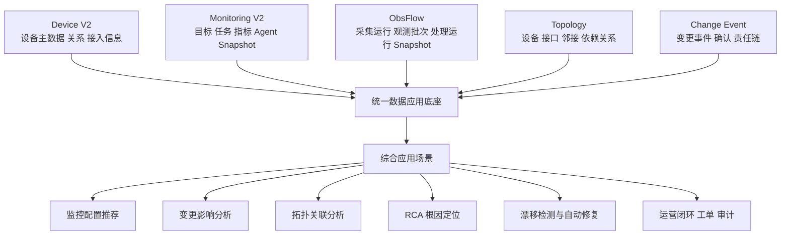

这张图表达的重点是：

- 现在各域都在产出数据
- 但真正决定平台能不能“综合应用”的，是中间这层统一底座
- 上层所有场景能力，本质上都依赖这层底座是否稳固

---

## 3. 为什么当前还不能直接进入“综合应用”

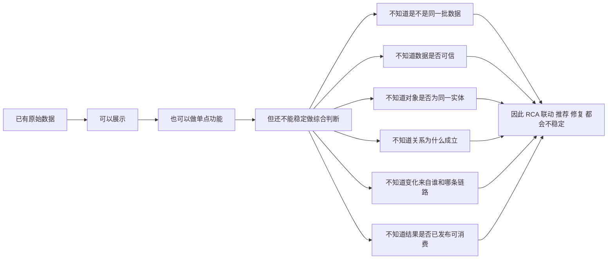

换句话说，当前最主要的问题不是“没有数据”，而是：

- 缺少统一身份
- 缺少统一时间与版本语义
- 缺少统一质量语义
- 缺少统一事件与关系语义

---

## 4. 基础能力分层图

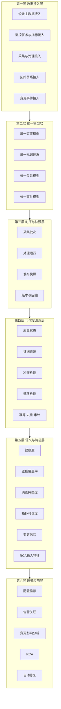

这张分层图有两个关键含义：

1. 综合应用不是直接从接入层跳到场景层
2. 中间至少要经过模型、快照、治理、语义这四层

---

## 5. 需要准备的 4 类核心基础能力

上一版把基础能力拆得偏细，更接近实现清单。
如果从方案评审和建设决策视角看，建议把它们收敛成下面 4 类核心能力。

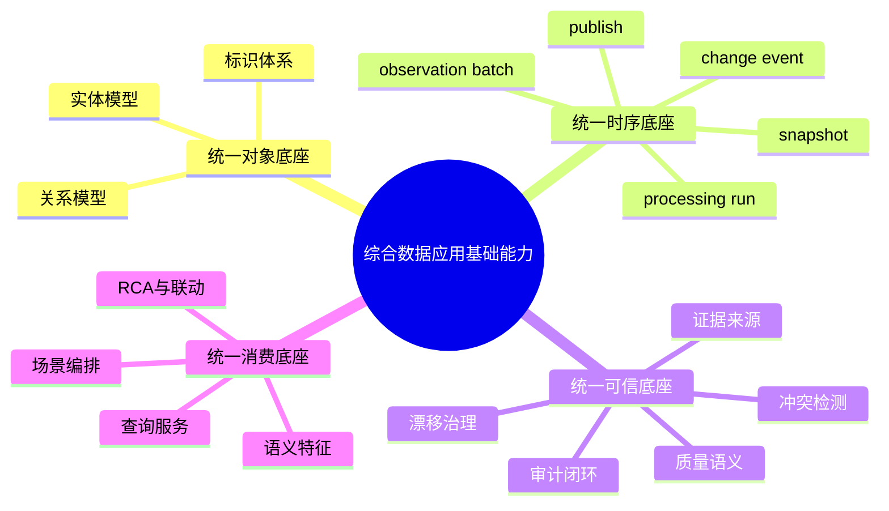

---

## 5.1 统一对象底座

这一类能力解决的是：

- 平台里“对象是谁”
- “对象和对象之间是什么关系”

建议把下面三项收敛为同一组能力来看：

- 统一实体模型
- 统一标识体系
- 统一关系模型

图示：

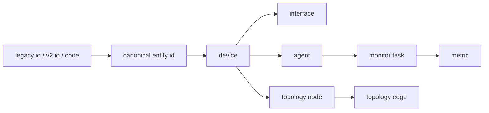

这类能力的目标不是多建几张表，而是建立一套统一对象视图，使平台能稳定回答：

- 这是不是同一个设备
- 这个 Agent 属于哪台设备
- 这个监控任务对应哪个目标实体
- 这条拓扑边和哪个设备接口有关

如果这一层不稳，后面的监控、拓扑、变更、RCA 就都只能做“弱关联”。

---

## 5.2 统一时序底座

这一类能力解决的是：

- 数据是在哪个时间点、哪次运行、哪份快照里形成的
- 对象是如何从“观测结果”演进成“可消费事实”的

建议把下面几项收敛为同一组能力来看：

- 采集批次
- 处理运行
- 快照与发布
- 变更事件

图示：

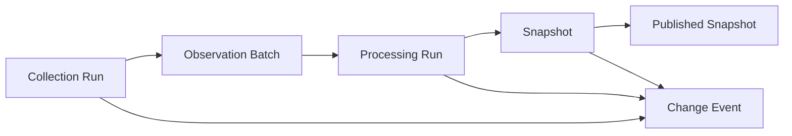

这类能力的核心价值是让平台明确知道：

- 当前结果来自哪一批 observation
- 当前关系图来自哪一版 snapshot
- 哪些变化是写入边界产生的事实事件
- 下游消费的是“运行中结果”还是“已发布结果”

如果没有统一时序底座，系统会一直停留在：

- 能跑
- 能查
- 但不知道是不是同一批事实

---

## 5.3 统一可信底座

这一类能力解决的是：

- 数据能不能被信任
- 数据冲突、漂移和异常时平台怎么判断和处理

建议把下面几项收敛为同一组能力来看：

- 质量与可信度语义
- 证据来源
- 冲突检测
- 漂移治理
- 审计与闭环

图示：

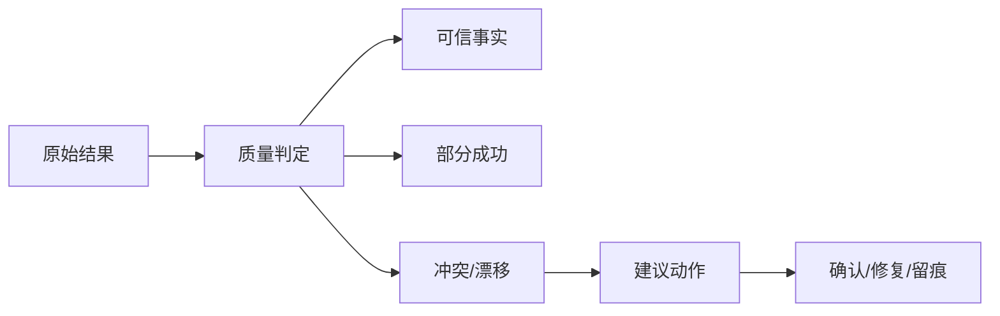

建议统一表达的状态至少包括：

- `ready`
- `partial`
- `stale`
- `failed`
- `synthetic`
- `conflicted`

这一层决定平台能不能区分：

- 真不存在
- 本次没采到
- 本次只采到部分
- 数据是补位值
- 多源数据互相打架

如果没有统一可信底座，后续所有高级能力都会面临同一个问题：

- 结果看起来像真的，但平台自己也不知道有多真

---

## 5.4 统一消费底座

这一类能力解决的是：

- 上层场景如何稳定、重复利用底层数据

建议把下面几项收敛为同一组能力来看：

- 语义特征层
- 统一查询服务
- 场景编排服务
- RCA、推荐、影响分析、修复联动

图示：

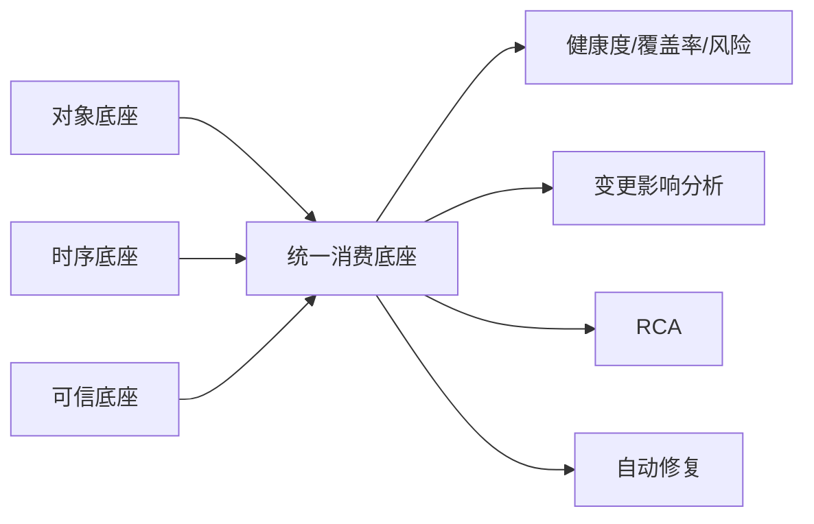

这类能力的关键不是“多做几个接口”，而是：

- 不让每个页面、每个任务、每个算法自己重复拼对象、拼时间线、拼质量判断
- 先沉淀平台语义，再统一输出给场景消费

优先可沉淀的消费结果包括：

- 健康度
- 监控覆盖率
- 纳管完整度
- 拓扑可信度
- 变更风险
- RCA readiness

---

## 5.5 四类能力的细项映射

为了兼顾方案清晰度和实现可落地性，可以把之前较细的能力项映射到这 4 类下面：

| 核心能力 | 细项 |
| --- | --- |
| 统一对象底座 | 实体模型、标识体系、关系模型 |
| 统一时序底座 | 采集批次、处理运行、快照发布、变更事件 |
| 统一可信底座 | 质量状态、证据来源、冲突检测、漂移治理、审计闭环 |
| 统一消费底座 | 语义特征、统一查询、场景编排、RCA/推荐/联动 |

这样做的好处是：

- 管理层讨论时只看 4 类
- 设计和实施时仍然能落到明确细项

---

## 6. 四类能力的依赖关系图

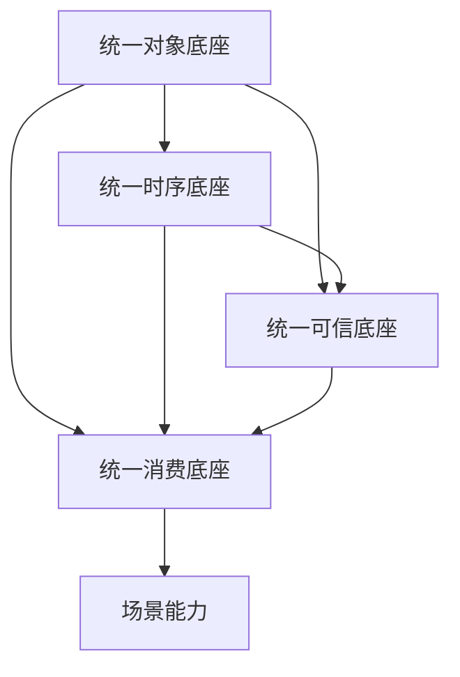

这里最重要的顺序是：

- 先把对象统一
- 再把时间线统一
- 再把可信度统一
- 最后把消费和联动做厚

---

## 7. 当前 OneOPS 现状放在这张图里的位置

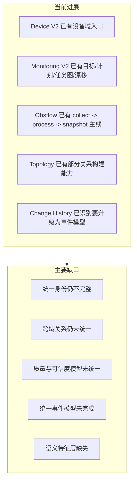

这意味着现在的平台状态更准确地说是：

- 已经具备多条主线
- 但还缺少横向收口层

---

## 8. 建议的建设顺序

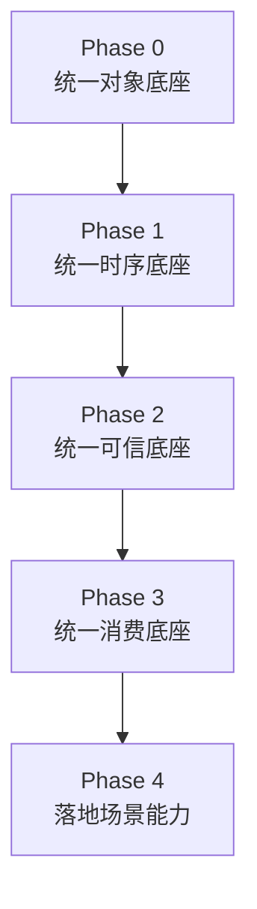

### Phase 0

优先完成：

- 统一实体主键和映射规则
- 统一设备、Agent、监控目标、拓扑节点之间的 canonical id
- 统一基础关系骨架

这是第一优先级。
没有对象底座，后续集成越多，混乱越大。

### Phase 1

优先打通：

- `collection run -> observation batch -> processing run -> snapshot -> publish`
- 变更事件与写入边界的挂接
- 监控图、拓扑图、处理结果的版本关联

目标是先把“同一时刻、同一版本、同一事实链”建立起来。

### Phase 2

优先建设：

- 统一 `ready / partial / stale / conflicted / synthetic` 等质量语义
- 建立证据来源和冲突表达
- 建立漂移检测、确认、修复、留痕闭环

目标是把平台从“有数据”升级到“知道哪些数据可信、哪些不可直接消费”。

### Phase 3

优先沉淀：

- 监控覆盖率
- 拓扑可信度
- 变更风险
- RCA readiness
- 纳管完整度

目标是形成平台级统一消费层，避免每个场景重复拼底层事实。

### Phase 4

最终落地：

- 监控推荐
- 变更影响分析
- 告警关联拓扑
- RCA
- 自动修复和闭环运营

---

## 9. 最小落地路径图

如果希望用最小代价验证“综合数据应用”主线，建议先走下面这条路径：

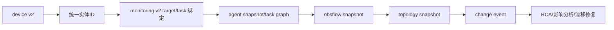

这个最小路径的好处是：

- 横跨资产、监控、观测、拓扑、变更五类数据
- 又不会一开始就要求平台一次性统一所有历史逻辑

---

## 10. 一句话总结

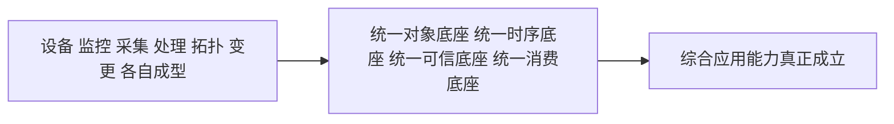

当前 OneOPS 的真实阶段，不是“没有能力”，而是：

- 已经进入从“多条单点主线”向“统一综合能力底座”收口的阶段

后续真正决定平台上限的，不再是继续补多少个任务、页面或接口，而是：

- 能否把统一对象底座、统一时序底座、统一可信底座、统一消费底座这四个核心底座做实

---

## 11. 后续文档建议

基于本文档，建议下一步继续补三份文档：

1. `综合数据应用目标架构图`
2. `综合数据应用统一领域模型`
3. `综合数据应用 M0/M1/M2 建设路线图`

这三份文档分别对应：

- 架构视图
- 模型视图
- 迭代视图

本文档优先解决的是：

- 能力视图
- 依赖视图
- 建设顺序视图
