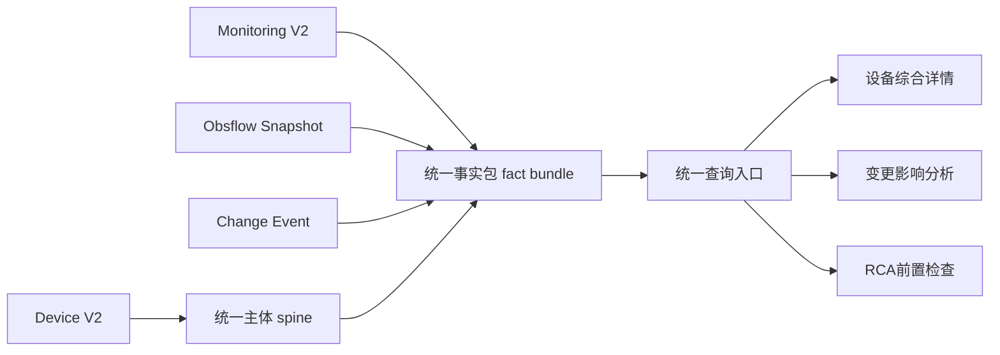
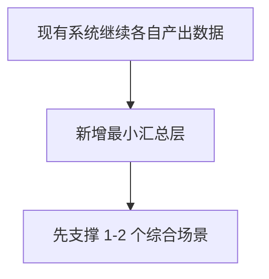
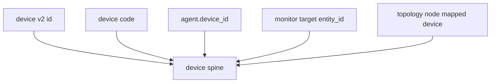
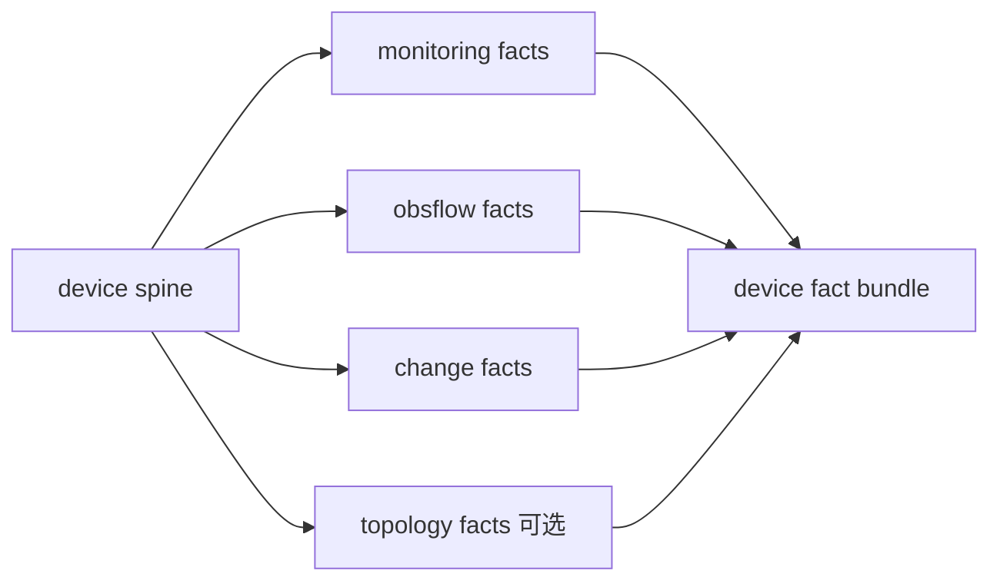
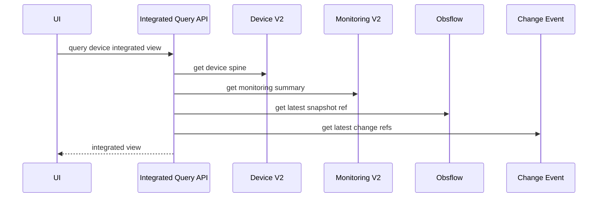
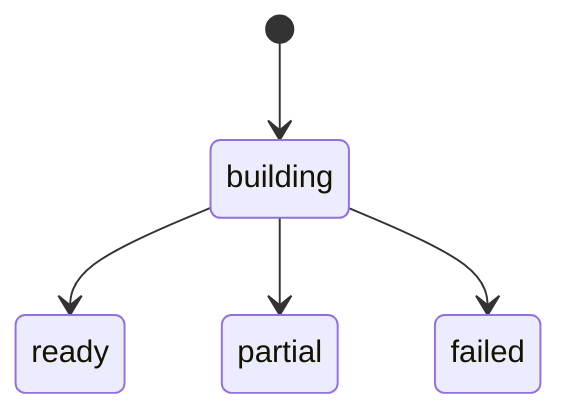
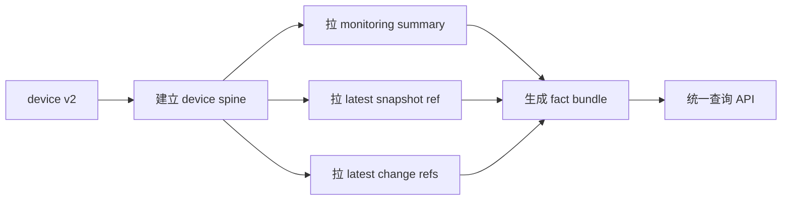
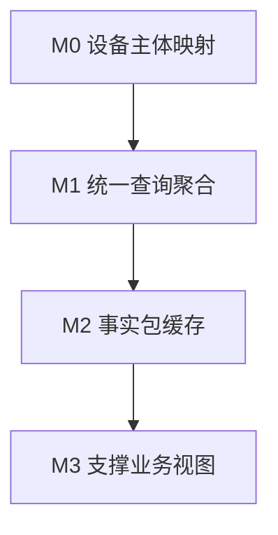
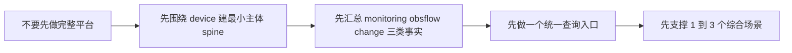

# OneOPS 极简数据综合应用基座

本文档只回答一个问题：

- 如果目标不是建设完整平台级数据底座
- 而是尽快做出一版“可运行、可接入、可支撑后续扩展”的极简基座
- 那么 OneOPS 最少需要做什么

本文档明确偏向：

- 快速实现
- 最小闭环
- 优先复用现有能力

本文档不追求：

- 一次性统一所有域模型
- 一次性重构所有历史链路
- 一次性建设完整图谱、完整事件平台、完整特征平台

---

## 1. 极简结论

如果只做一版能快速落地的“数据综合应用基座”，建议只做 3 个东西：

1. 一个统一主体
2. 一个统一事实包
3. 一个统一查询入口

用一句话说就是：

- 先围绕 `device` 建一条最小主线，把设备、监控、观测、变更这四类事实在一个主体下汇总出来

不先做：

- 全域统一图谱
- 全量统一事件总线
- 全平台统一特征仓
- 全部对象统一身份体系

先只做：

- `device` 这一类主体的综合视图

---

## 2. 极简基座总览图

这版极简方案的核心思想是：

- 不先统一所有对象
- 只先统一“设备主体”
- 所有综合应用先围绕设备展开

---

## 3. 为什么这版最容易落地

因为它最大化复用了当前已有的东西：

- `device v2` 已经能提供设备主体入口
- `Monitoring V2` 已经有目标、任务、Agent Snapshot、任务图
- `obsflow` 已经有 `collection -> process -> snapshot`
- `device v2 change history redesign` 已经明确了事件化方向

所以这版极简方案不要求新增一个“大而全平台”，而是只要求新增一个“汇总层”。

图示：

---

## 4. 极简基座只保留 3 类能力

## 4.1 统一主体 spine

这版只统一一种主体：

- `device`

它的作用不是替代所有对象模型，而是做一个最小锚点：

- 后续所有监控、观测、变更都先挂到设备主体上

图示：

这层最小要求只有两个：

1. 平台能确定“这是不是同一台设备”
2. 平台能把相关事实挂到这台设备上

这版不要求：

- 接口主键统一完成
- 应用实体统一完成
- 所有拓扑节点身份统一完成

---

## 4.2 统一事实包 fact bundle

这版不建设复杂的统一数仓。
只围绕设备生成一份“当前综合事实包”。

建议事实包结构如下：

建议最小字段只包含：

- `device_id`
- `device_code`
- `device_name`
- `agent_code`
- `monitoring_summary`
- `latest_snapshot_ref`
- `latest_change_refs`
- `topology_summary`
- `fact_status`
- `updated_at`

这版不做大而全字段。
只保留“综合应用立即用得上的摘要事实”。

### monitoring_summary 最小内容

- 是否已绑定监控目标
- 是否存在监控任务
- 最近一次 Agent Snapshot 版本
- 任务数量
- 是否存在 drift

### latest_snapshot_ref 最小内容

- 最新 snapshot code
- task name
- published_at
- readiness

### latest_change_refs 最小内容

- 最近 N 条关键变更
- 来源链路
- 发生时间
- 是否已确认

### topology_summary 最小内容

第一版可极简，只保留：

- 是否存在 topology 映射
- 邻接数或关联边数

如果当前拓扑映射成本高，这块甚至可以延后成可选字段。

---

## 4.3 统一查询入口

极简方案不要一开始就做一堆复杂 API。
只做一个统一查询入口即可：

- `GetDeviceIntegratedView(device_id or device_code)`

图示：

这个入口先满足 3 个场景即可：

1. 设备综合详情
2. 变更影响分析前置视图
3. RCA 前置检查视图

---

## 5. 极简基座的最小数据模型

为了快速实现，建议只新建 2 张表，或者 1 张表 + 1 张物化缓存。

## 5.1 `integrated_subject_device`

作用：

- 保存设备主体 spine

建议字段：

- `device_id`
- `device_code`
- `device_name`
- `agent_code`
- `monitor_target_id`
- `topology_node_id`
- `status`
- `updated_at`

说明：

- 这张表不存所有设备详情
- 只存综合应用必须的主键映射

## 5.2 `integrated_device_fact_bundle`

作用：

- 保存设备的综合事实包

建议字段：

- `device_id`
- `fact_version`
- `monitoring_summary_json`
- `snapshot_ref_json`
- `change_refs_json`
- `topology_summary_json`
- `fact_status`
- `updated_at`

说明：

- 这张表本质上是读优化层
- 允许先以 JSON 形式承载摘要
- 不追求第一版彻底结构化

---

## 6. 极简状态模型

这版状态不要太多。
建议统一收敛成 3 个状态：

- `ready`
- `partial`
- `failed`

图示：

判断规则也尽量简单：

- `ready`
  - device 主体存在
  - 至少拿到 monitoring 或 snapshot 其中一种事实
- `partial`
  - device 主体存在
  - 但事实不完整或部分来源失败
- `failed`
  - 连 device 主体都无法建立
  - 或综合查询整体失败

这版先不引入：

- `stale`
- `synthetic`
- `conflicted`

这些可以放到后续增强版。

---

## 7. 极简主线流程

这条主线非常刻意地做了减法：

- 不做实时全量联动
- 不做复杂事件驱动编排
- 不做全域关系图构建

先做：

- 查询时聚合
- 或后台异步汇总

二选一即可。

如果追求最快上线，建议第一版直接：

- 查询时聚合

如果追求更稳定的页面性能，再补：

- 后台异步刷新 `fact bundle`

---

## 8. 极简方案的明确边界

这版必须明确“不做什么”，否则很快又膨胀回完整平台方案。

## 8.1 第一版不做

- 不做全对象统一身份
- 不做完整统一事件平台
- 不做完整统一图谱平台
- 不做全量特征计算平台
- 不做自动修复执行编排
- 不做跨对象复杂联动查询

## 8.2 第一版只做

- 只围绕 `device` 主体
- 只汇总 `monitoring / obsflow / change`
- 只提供一个统一查询入口
- 只支撑 1 到 3 个综合视图

---

## 9. 建议的最小接口

第一版建议只开放下面 3 个接口：

### 9.1 获取设备综合视图

- `GET /platform/integrated/devices/:id`

返回：

- device spine
- monitoring summary
- latest snapshot ref
- latest change refs
- fact status

### 9.2 批量获取设备综合摘要

- `POST /platform/integrated/devices/query`

返回：

- 多台设备的摘要视图

用于：

- 设备列表打标签
- 风险筛选
- 快速盘点

### 9.3 刷新设备事实包

- `POST /platform/integrated/devices/:id/refresh`

用于：

- 调试
- 对账
- 手工强制刷新

这版不建议先开放更多接口。

---

## 10. 建议的最短建设顺序

## M0 设备主体映射

先做：

- `device_id / device_code / agent_code / monitor_target_id` 映射

验收标准：

- 给一台设备，平台能稳定找到它的监控和 Agent 关联

## M1 统一查询聚合

先不落缓存，直接聚合查询：

- 设备主体
- 监控摘要
- 最新 snapshot 引用
- 最近变更引用

验收标准：

- 能返回一份完整 `device integrated view`

## M2 事实包缓存

当 M1 跑通后，再补：

- `integrated_device_fact_bundle`

验收标准：

- 页面查询不再每次跨多个服务实时拼接

## M3 支撑业务视图

先支撑下面 3 个页面或视图：

1. 设备综合详情
2. 变更影响分析前置面板
3. RCA 前置检查面板

---

## 11. 极简版验收标准

如果一版极简基座要算“做成了”，建议只看下面 5 条：

1. 给定一台设备，平台能返回一份统一综合视图
2. 这份视图至少包含监控、快照、变更三类事实
3. 平台能给出 `ready / partial / failed` 三态判断
4. 上层页面不需要再自己跨多个域接口拼数据
5. 后续可以在不推翻这版结构的前提下继续加字段和加场景

---

## 12. 一句话总结

极简数据综合应用基座的真正目标不是“一步到位”，而是：

- 用最小代价先把“设备综合事实”这条主线跑通

只要这条主线成立，后续再向：

- topology
- application
- RCA
- drift repair

扩展时，就已经有了一个不会推倒重来的起点。
