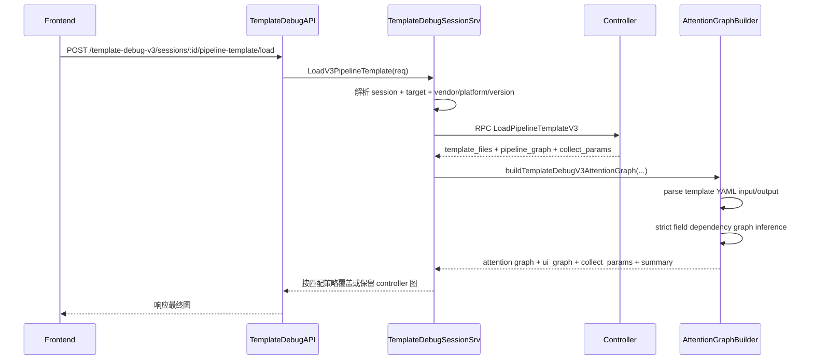

# Template Debug V3 当前架构与重构基线（2026-03-19）

适用范围：`OneOps`（后端）、`ctrlhub/controller`（模板源）、`OneOPS-UI`（调试画布）

## 1. 文档目标

本文件用于在进入下一轮代码重构前，固定当前实现的真实架构与边界，避免重构过程中偏离已达成的能力目标。

当前必须保持的核心语义：

1. 调试链路为 `前端 -> OneOps -> Controller -> templates`。
2. `Attentions` 用于定义标准 pipeline（按 `target.type` 分组），每次调试一组。
3. pipeline 连线严格由模板 `input/output` 字段推断，不做默认连线、不做兜底连线、不做智能补边。
4. 生成连线时同步 stage 的 `input_fields/fields`，确保节点参数与连线依赖一致。

## 2. 当前架构图（As-Is）

```mermaid
flowchart LR
  FE[Frontend Debug UI]
  API[TemplateDebugAPI\n/template-debug-v3/...]
  SVC[TemplateDebugSessionSrv\n(template_debug_v3.go)]
  RPC[Controller RPC Gateway\ncallTemplateDebugV3ControllerRPC]
  CTRL[Controller RPC\nLoadPipelineTemplateV3]
  ATT[Attention Graph Builder\n(template_debug_v3_attention_graph.go)]
  CFG[OneOps Config.Attentions]
  TPL[Controller template_files]
  YAML[YAML IO Parser]
  DB[(OneOps V2 DB tables)]

  FE --> API --> SVC
  SVC --> DB
  SVC --> RPC --> CTRL
  CTRL --> TPL --> SVC
  SVC --> ATT
  ATT --> CFG
  ATT --> YAML
  YAML --> ATT
  ATT --> SVC
  SVC --> API --> FE
```

## 3. 关键调用时序（Load Template）



## 4. 代码落点（当前真实实现）

1. V3 路由入口：
   - `OneOps/app/platform/router/platform.go`
2. API 入口：
   - `OneOps/app/platform/api/template_debug.go`
3. V3 编排主入口：
   - `OneOps/app/platform/service/impl/template_debug_v3.go`
4. Attention 图构建：
   - `OneOps/app/platform/service/impl/template_debug_v3_attention_graph.go`
5. V3 DTO：
   - `OneOps/app/platform/dto/template_debug_v3.go`
6. 主测试：
   - `OneOps/app/platform/service/impl/template_debug_v3_attention_graph_test.go`
   - `OneOps/app/platform/service/impl/template_debug_v3_load_template_test.go`

## 5. 当前职责分层（实际）

## 5.1 API 层

职责：
1. 参数绑定与基础校验。
2. 调用 `TemplateDebugSessionSrv`。
3. 统一错误响应（含结构化错误透传）。

## 5.2 Service 编排层（`template_debug_v3.go`）

职责：
1. session 状态与 target/credential 约束校验。
2. vendor/platform/version 解析与补齐。
3. 调用 Controller RPC。
4. 解析 RPC 响应并规范空数组/空 map。
5. 调用 attention graph 进行图覆盖或回退。
6. 部分 V3->V2 持久化桥接。

## 5.3 Attention 图引擎（`template_debug_v3_attention_graph.go`）

职责：
1. 从 `Attentions` 选出 vendor/platform/version 命中项。
2. 根据 `target_type` 过滤单组 pipeline。
3. 从 `template_files.content` 解析 stage input/output 字段。
4. 严格推断边：
   - 仅当 `from.outputs ∩ to.inputs` 非空才连线。
5. 节点字段同步：
   - 规范化每个 stage 的 `input_fields/fields`。
   - `input_fields` 收敛为真实命中的上游依赖字段。
6. `ui_graph` 严格过滤 collect 节点，不跨 collect 桥接。
7. 解析 collect 参数（OID/command/output_field）。

## 6. 已达成契约（重构不可破坏）

1. `target_type` 请求可选；传入时必须单组返回。
2. 请求了缺失 `target_type` 时返回空图，不回退混合图。
3. `summary` 返回：
   - `target_types`
   - `selected_target_type`
   - `target_type_missing`
   - `graph_scope`
4. 连线推断严格字段依赖，不存在顺序补边。
5. 返回的 stage `input_fields/fields` 与推断边一致。
6. `ui_graph` 不含 collect 节点。

## 7. 当前架构问题（重构驱动点）

1. `template_debug_v3.go` 文件过大，混合了编排、RPC、持久化、transform debug 多种职责。
2. load/collect/preview 的公共流程（参数规范化、RPC 调用、错误映射）重复。
3. attention graph 内部仍有可清理无效函数和可拆分点，影响可读性。
4. 单测覆盖已可用，但测试语义分散，后续扩展难度高。

## 8. 第一轮重构边界（建议）

目标：只做结构重整，不改外部 API 契约，不改现有行为语义。

## 8.1 建议拆分

1. `template_debug_v3_loader.go`
   - 仅承接 `LoadV3PipelineTemplate` 编排。
2. `template_debug_v3_rpc_client.go`
   - 统一封装 `callTemplateDebugV3ControllerRPC` 与错误映射。
3. `template_debug_v3_graph_overlay.go`
   - 统一处理 controller 图与 attention 图融合策略。
4. `template_debug_v3_stage_io_parser.go`
   - 从 attention graph 中拆出模板 YAML IO 解析。
5. `template_debug_v3_collect_resolver.go`
   - 从 attention graph 中拆出 collect 参数推断与别名解析。

## 8.2 本轮明确不做

1. 不新增业务接口。
2. 不修改前端协议字段。
3. 不改变 strict edge inference 规则。
4. 不改动 V2 持久化模型。

## 9. 重构验收标准

1. 行为不变：
   - 既有 `LoadV3PipelineTemplate` 测试全部通过。
   - strict edge + 节点字段同步相关测试全部通过。
2. 结构改进：
   - `template_debug_v3.go` 主文件职责明显减重。
   - RPC、graph overlay、IO parser 可独立单测。
3. 交付可维护：
   - 新文件命名与职责清晰。
   - AI 交接文档能直接映射到新文件。

## 10. 重构执行建议顺序

1. 先抽 RPC client（低风险）。
2. 再抽 load 编排（中风险）。
3. 再抽 attention graph 内部 parser/resolver（中风险）。
4. 最后清理无效函数并补齐单测命名。

---

最后更新：2026-03-19
