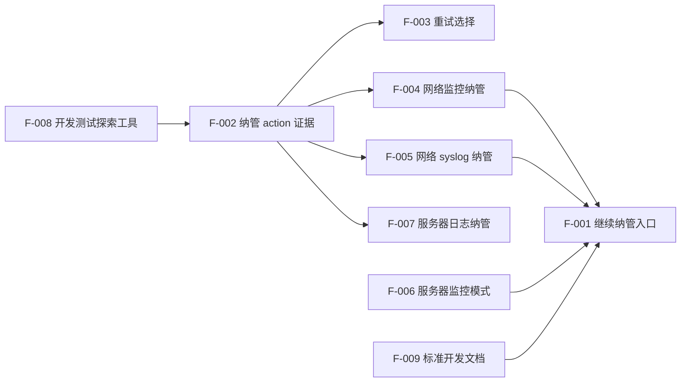

# 【功能清单】OneOPS_v0.1

## 1. 文档信息

| 项目 | 内容 |
| --- | --- |
| 系统名称 | OneOPS |
| 版本号 | v0.1 |
| 模块名称 | Device V2 纳管观测 |
| 文档状态 | 草案 |

## 2. 需求理解摘要

Device V2 纳管观测要求用极简机制补齐监控纳管、日志纳管和远程配置证据。核心原则是单设备手动执行、自动保存证据、失败尽早暴露、业务远程服务器操作通过 controller API。

## 3. 功能清单

| 功能编号 | 功能名称 | 功能说明 | 优先级 | 依赖 | 验收条件 | 备注 |
| --- | --- | --- | --- | --- | --- | --- |
| F-001 | 继续纳管入口 | 在 Device V2 页面为单设备提供继续纳管 | P0 | Device V2 页面 | 只允许单台执行，批量不执行 | D2ON-003 |
| F-002 | 纳管 action 证据 | 记录监控/日志 action 结果 | P0 | store run summary_json | 成功/失败/unknown/skipped 可区分 | D2ON-001 |
| F-003 | 重试选择 | 只重试 failed/unknown ensure action | P0 | F-002 | success action 不重复执行 | D2ON-001 |
| F-004 | 网络监控纳管 | 网络设备下发监控任务 | P0 | 现有监控任务机制 | 下发成功即监控纳管成功 | D2ON-002 |
| F-005 | 网络 syslog 纳管 | 配置网络设备 syslog 目标为区域 agent | P0 | 区域 syslog listener、netlink | 配置成功并保存证据 | D2ON-004 |
| F-006 | 服务器监控模式 | 用户选择 agent 或 SNMP | P0 | UI/API | 未选择时不执行 | D2ON-003 |
| F-007 | 服务器日志纳管 | agent 优先，无 agent 生成 SSH 配置计划 | P1 | controller API | 不绕过 controller API | D2ON-005 |
| F-008 | 开发测试探索工具 | 探索真实设备命令和日志文件 | P0 | 授权测试设备 | 只用于开发测试，不被业务调用 | D2ON-000 |
| F-009 | 标准开发文档 | 按模板维护需求、接口、设计、测试文档 | P0 | 模板目录 | 代码变更同步更新文档 | D2ON-DOC |

## 4. 非功能性需求清单

| 编号 | 类型 | 需求 | 优先级 | 可测试指标 | 备注 |
| --- | --- | --- | --- | --- | --- |
| NF-001 | 可靠性 | 远程失败必须返回明确错误 | P0 | 错误可在 UI/API/evidence 看到 | 不吞错 |
| NF-002 | 安全 | 凭据不得写入仓库文档 | P0 | 文档与配置无明文凭据 | 测试时从运行环境输入 |
| NF-003 | 可维护性 | 业务路径不依赖开发测试工具 | P0 | 业务代码不引用 tools/d2on | 强制边界 |
| NF-004 | 范围控制 | 不做全局前后端变更 | P0 | diff 限定在允许路径 | OpenClaw 约束 |

## 5. 功能依赖关系

## 6. 优先级定义

| 优先级 | 定义 |
| --- | --- |
| P0 | 首期必须完成，否则无法形成可验证闭环 |
| P1 | 首期需要设计并尽量实现，可在明确阻塞时延期 |
