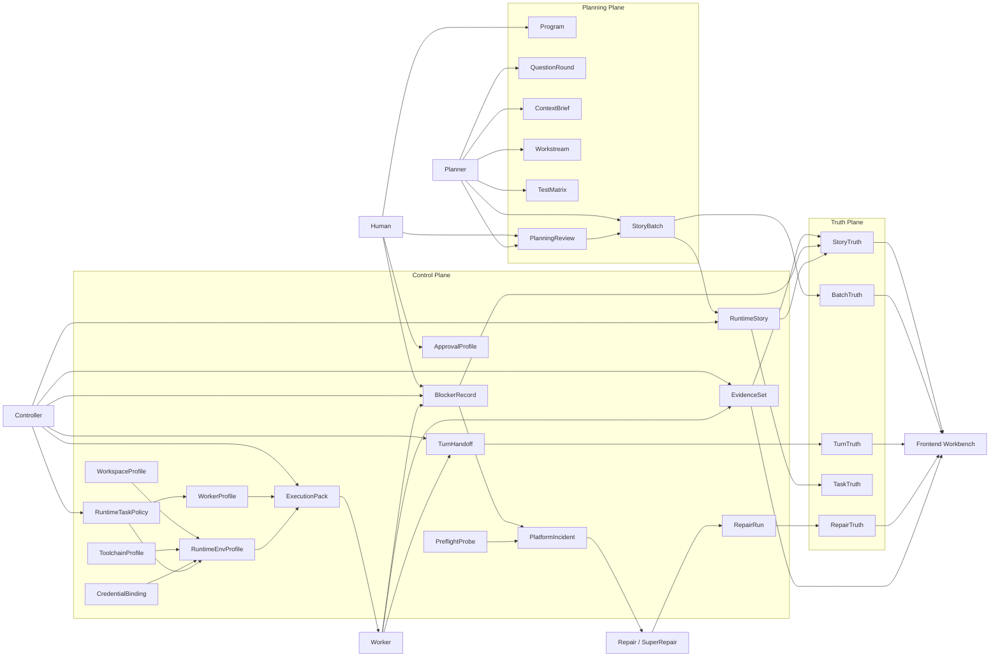
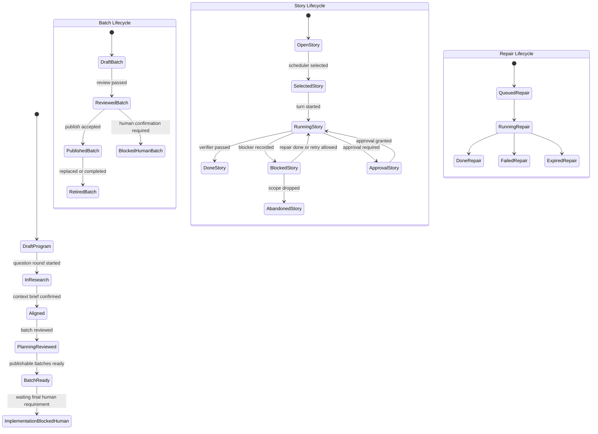
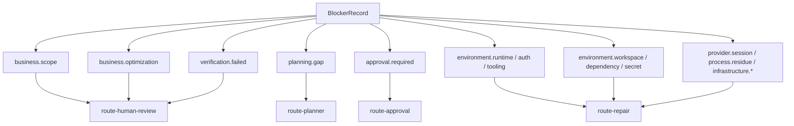
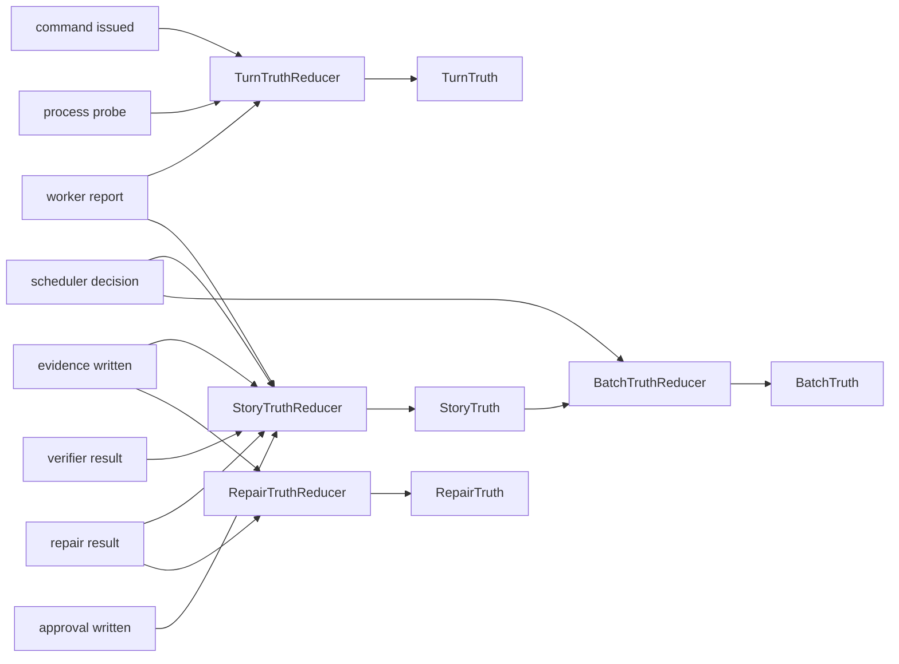
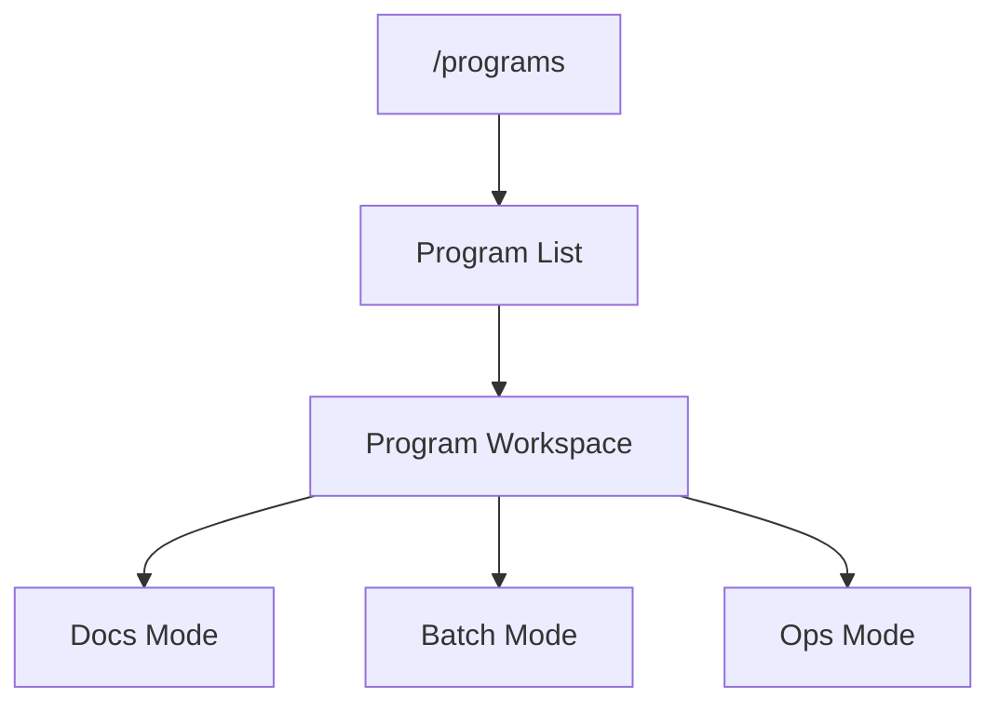

# Role Object State Map

## Purpose

- 这份文档是 [object-state-freeze-checklist.md](/Users/huangliang/project/OneOPS-ALL/docs/prd-autodev/generic-ai-autodev-platform/object-state-freeze-checklist.md) 的关系图版本。
- 目标不是补充新对象，而是把“谁负责什么、谁读写什么、状态怎样流动、前端该看什么”画清楚。
- 后续前端专题讨论、后端接口设计、`dagengine` 承接边界，都应以这份图为准。

## 1. 角色与平面

## 2. 读写边界

### 角色读写矩阵

| 角色 | 可写对象 | 只读对象 | 禁止直接改写 |
|---|---|---|---|
| `Human` | `Program` 边界、`PlanningReview`、`ApprovalProfile`、审批记录 | 全部 truth、evidence、batch、blocker | `StoryTruth`、`TurnTruth`、运行时中间态 |
| `Planner` | `QuestionRound`、`ContextBrief`、`Workstream`、`TestMatrix`、`StoryBatch`、`PlanningReview` | 执行摘要、evidence、truth 投影 | `RuntimeStory`、`RepairRun` |
| `Controller` | `RuntimeStory`、`ExecutionPack`、`TurnHandoff`、`BlockerRecord`、`EvidenceSet` | reviewed `StoryBatch`、profile、truth | `Program`、`PlanningReview` |
| `Worker` | `TurnHandoff`、patch、执行 evidence、执行 blocker 报告 | `ExecutionPack`、必要代码上下文 | `StoryBatch`、`StoryTruth` |
| `Repair / SuperRepair` | `PlatformIncident`、`RepairRun`、repair evidence、repair blocker 更新 | `BlockerRecord`、runtime env profile、probe 结果 | `PlanningReview`、`StoryBatch` |
| `Frontend Workbench` | 简单状态推进动作、审批动作、发布动作 | truth、evidence、planning/control 对象 | 零散状态文件、脚本中间态 |

### 必须坚持的 4 个规则

1. `Planner` 不直接改执行态，只基于 reviewed 的结果和 evidence 继续规划。
2. `Worker` 不直接写 truth，只提交 report、evidence、blocker 事实。
3. `Frontend` 不直接消费 `state.json / progress.json / last-report.txt` 这类零散文件。
4. `Repair / SuperRepair` 只修基础设施与平台机制问题，不改业务 scope。

## 3. 状态流转

## 4. Blocker 路由图

### 当前必须记住的边界

- `environment.*` 不自动回流 `Planner`
- `approval.required` 不自动触发 `Repair`
- `planning.gap` 才能进入下一轮 `Planner`

## 5. 真相源关系

### UI 只应该看什么

- `Program Workspace` 看：
  - `Program`
  - `Workstream`
  - `TestMatrix`
  - `StoryBatch`
  - `PlanningReview`
- `Batch Review Mode` 看：
  - `StoryBatch`
  - `BatchTruth`
  - `StoryTruth`
  - `release gate`
- `Execution / Repair Summary` 看：
  - `TaskTruth`
  - `TurnTruth`
  - `StoryTruth`
  - `RepairTruth`
  - `BlockerRecord`
  - `PlatformIncident`
  - `PreflightProbe`
  - `EvidenceSet`

## 6. 前端首期工作台映射

### 顶层导航建议

### 模式与对象对应

| 工作台模式 | 首期主要对象 | 核心动作 |
|---|---|---|
| `Docs Mode` | `Program`、`QuestionRound`、`ContextBrief`、`Workstream`、`TestMatrix` | 只读、审阅、简单手动修订、状态推进 |
| `Batch Mode` | `StoryBatch`、`PlanningReview`、`BatchTruth`、`StoryTruth` | review、blocked-human-confirmation、publish-ready 审核 |
| `Ops Mode` | `WorkerProfile`、`WorkspaceProfile`、`ToolchainProfile`、`CredentialBinding`、`RuntimeEnvProfile`、`PreflightProbe`、`PlatformIncident`、`BlockerRecord`、`RepairRun`、`EvidenceSet` | blocker 查看、repair 跟踪、approval 动作、readiness 审阅 |

### 当前已确认

1. `WorkspaceProfile / ToolchainProfile / CredentialBinding` 作为首期模型冻结对象保留。
2. `PlatformIncident` 作为 repair 平面一等对象保留。
3. 首期前端必须展示 `profile / incident` 只读摘要。

## 7. 进入代码前还需人工确认的点

1. 首期前端是否接受 `Program Workspace -> Docs / Batch / Ops` 三模式结构。
2. `profile / incident` 只读摘要是挂在右侧决策栏，还是以独立 `Ops Mode` 承载。
3. `TaskTruth / StoryTruth / TurnTruth / RepairTruth` 是否采用当前建议的四层拆分，不再合并成一层 task status。

## Recommended Next Step

1. 以上 4 个点做一次人工对齐。
2. 基于这份图，进入前端专题讨论。
3. 对齐后再冻结首页信息架构与 API 对象边界。
