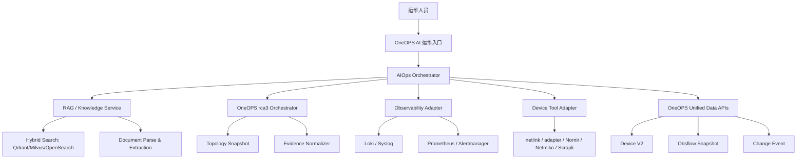

# 网络运维智能体融入 OneOPS 调研

## 1. 结论先行

OneOPS 适合走“平台事实 + RCA 内核 + RAG/Agent 编排”的路线，而不是直接嵌一个通用聊天机器人。

推荐 MVP：

- 在告警/设备/日志上下文中提供 AI 诊断入口。
- 用外部 RAG/Agent 平台处理知识库、问答编排、提示词和评测。
- OneOPS 保留事实源、权限、RCA 合约、设备采集和审计。
- LLM 负责解释、归纳、生成排障步骤和交互追问，不负责单独裁决根因。

## 2. OneOPS 当前真实基础

### 2.1 RCA 已有良好接口边界

`OneOPS/pkg/rca2/contract.go` 已把输入压成 `Observation`、`Path`、`NodeFact`，再通过 `Profile` 把事实映射成模式、信号和候选分数。它适合作为层内可解释 RCA 决策内核。

`OneOPS/pkg/rca3/types.go` 和 `interfaces.go` 已经有更适合 AI 编排的模型：

- `AnalyzeRequest` 包含 `Scope`、`Topology`、`PathSets`、`Alerts`、`NodeEvidence`、`EdgeEvidence`、`PathEvidence`。
- `Evidence` 已经能表达 `Kind`、`Source`、`Summary`、`ObservedAt`、`Confidence` 和扩展属性。
- `Orchestrator`、`EvidenceNormalizer`、`LayerDecisionEngine`、`CrossLayerReducer`、`Presenter` 已把装配、裁决、收敛、呈现分开。

这意味着 AI 不需要重做 RCA。更合理的是新增一个 `AIOps Orchestrator` 调用 `rca3`，再把结果和知识库证据组织成用户能读懂的诊断报告。

### 2.2 平台无关 RCA 契约应继续保持

`docs/RCA_PLATFORM_AGNOSTIC_MINIMAL_CONTRACT.md` 已明确 OneOPS 的角色是把平台内拓扑、告警、日志映射成 RCA 契约。文档还强调真实网络多路径常态，不能默认树形拓扑或唯一路径。

这对 AI 智能体很关键：LLM 输出不能绕过契约直接“猜网络”，否则会破坏现有 RCA 的可验证性。

### 2.3 综合数据底座已经定义方向

`docs/ONEOPS_DATA_APPLICATION_FOUNDATION_CAPABILITY_MAP_2026-04-10.md` 提出统一对象、统一时序、统一可信、统一消费四层。AI 运维智能体实际就是“统一消费底座”的一个高价值场景，依赖：

- 统一对象：设备、接口、Agent、监控目标、拓扑节点、告警对象能对齐。
- 统一时序：collection run、observation batch、processing run、snapshot、change event 能串起来。
- 统一可信：ready、partial、stale、failed、synthetic、conflicted 能进入证据质量。
- 统一消费：健康度、变更风险、RCA readiness、拓扑可信度能被问答和 RCA 调用。

### 2.4 可观测数据已有入口但需要标准化

OneOPS README 已描述 Prometheus、Grafana、Loki、rsyslog、Telegraf 网络设备日志推送链路。`docs/LOGGING_STANDARD_PROPOSAL.md` 已提出统一日志字段、模块、事件、采样和敏感信息规则。

对智能体来说，日志接入不只是全文搜索，还要规范成 `Evidence`：

- `kind=log`
- `source=loki|mongodb|device_syslog|oneops`
- `summary=标准化摘要`
- `observed_at=事件时间`
- `attributes.device_code/interface/alert_id/run_id`

## 3. 外部开源组件调研

### 3.1 RAG/Agent 平台

| 组件 | 适合用途 | 优点 | 风险 | 建议 |
| --- | --- | --- | --- | --- |
| Dify | 快速搭建聊天、工作流、知识库、工具调用 | 开源、可视化工作流、知识库、工具/API 发布能力完整 | 平台模型较重，用户/权限/知识库模型可能与 OneOPS 重叠 | 适合 PoC 或作为旁路 AI 编排服务 |
| RAGFlow | 文档解析、RAG、Agent、深文档理解 | 对复杂文档解析和知识库场景友好，仓库含 deepdoc/rag/agent/mcp 等模块 | 服务栈较重，深度集成成本需验证 | 适合私有知识文档解析 PoC |
| LlamaIndex | 自研 RAG/Agent 编排库 | 适合深度嵌入 OneOPS，可控性强，支持 RAG、结构化抽取、Agent、工具调用 | 需要自己做管理 UI、权限、运维面 | 适合长期内嵌式实现 |
| Haystack | RAG Pipeline 框架 | Pipeline 抽象清晰，适合可测试、可替换检索和生成链路 | 产品化 UI 需要自建或集成 | 适合后端服务化 RAG 管线 |

建议：短期 PoC 用 Dify 或 RAGFlow，长期产品内核用 LlamaIndex/Haystack 风格的自有 `aiops-service`，避免 OneOPS 被外部平台的数据模型绑死。

### 3.2 向量与混合检索

| 组件 | 适合用途 | 建议 |
| --- | --- | --- |
| Milvus | 大规模向量、稠密 + 稀疏混合检索 | 文档量和租户量较大时优先 |
| Qdrant | 向量检索、过滤、混合查询，部署相对轻 | MVP/中型部署优先 |
| OpenSearch | BM25、日志检索、向量/神经检索混合 | 如果已用 ES/OpenSearch 生态，适合统一全文与向量 |
| Weaviate | 向量 + hybrid search + schema | 若需要较强 schema/对象化知识库可评估 |

网络运维知识库强烈建议用混合检索：厂商命令、错误码、接口名、日志关键字依赖精确匹配；故障现象和排障经验依赖语义匹配。

### 3.3 网络 SoT、自动化与验证

| 组件 | 适合用途 | OneOPS 关系 |
| --- | --- | --- |
| NetBox | 网络 SoT、IPAM/DCIM、API、插件 | 可借鉴模型，不建议替换 OneOPS 设备主数据 |
| Nautobot | SoT + Jobs + Apps + Git 数据源 + GraphQL/REST | 可作为外部 SoT/自动化生态参考，Golden Config 值得评估 |
| Batfish | 配置静态分析、路由/ACL/可达性验证 | 适合作为“配置变更影响分析”工具服务 |
| Nornir | Python 自动化任务框架 | 适合批量只读诊断采集和受控 Runbook |
| Netmiko | 多厂商 SSH CLI show/config | OneOPS 已有 netlink/adapter 时，优先做兼容适配，不重复造入口 |
| Scrapli | CLI/NETCONF 设备交互库，含 Python/Go 绑定 | 可作为未来替换/补充 netlink 驱动的候选 |
| pyATS/Genie | 解析、学习设备状态、网络测试 | 厂商生态强，但集成和授权/部署边界需单独评估 |

建议：OneOPS 保持自己的设备和采集主线；引入 Batfish/Nornir/Netmiko/Scrapli 这类工具时，通过 `Tool Adapter` 暴露给智能体，不直接让 LLM 执行命令。

### 3.4 可观测与告警

| 组件 | 适合用途 | OneOPS 关系 |
| --- | --- | --- |
| Prometheus + Alertmanager | 指标告警、告警分组、抑制、静默 | OneOPS 已有 Prometheus 基础，适合提供 alert source |
| Grafana Loki | 日志聚合、LogQL、标签过滤 | OneOPS README 已描述 Loki 网络设备日志链路 |
| OpenTelemetry | traces/metrics/logs 标准化 | 适合后续统一 OneOPS 自身服务可观测 |
| Apache SkyWalking | APM/可观测平台 | 若 OneOPS 需要应用链路追踪，可评估，不是网络 RCA MVP 必需 |

建议：MVP 不新建 AIOps 可观测平台，先复用 Prometheus/Loki/Grafana，把告警和日志标准化为 `rca3.Evidence`。

## 4. 推荐目标架构

核心边界：

- OneOPS UI 只负责入口、上下文和展示，不承载 Agent 复杂状态。
- `AIOps Orchestrator` 是新服务或新模块，负责意图识别、工具规划、权限校验、证据聚合、报告生成。
- `RAG / Knowledge Service` 可以先接 Dify/RAGFlow，后续沉淀为自有服务。
- `OneOPS rca3` 继续作为根因计算骨架。
- `Device Tool Adapter` 必须限制命令白名单、只读优先、人工审批、审计。

## 5. MVP 场景建议

### 场景 A：告警详情 AI 分析

输入：

- 当前告警。
- 设备、接口、拓扑快照。
- 近 30 到 120 分钟日志与指标摘要。
- 最近变更事件。
- 匹配到的知识库条目。

输出：

- 现象摘要。
- 证据列表。
- RCA 候选，引用 `rca3`/`rca2` 的候选对象和原因。
- 排查步骤，按“低风险只读检查 -> 需要确认操作 -> 修复建议”分级。
- 缺失证据和下一步采集建议。

### 场景 B：设备异常自然语言问答

示例：

- “核心交换机 SW01 端口 Gi1/0/24 最近频繁 down/up，可能是什么原因？”
- “Fortigate 日志里 deny 激增，怎么排查？”
- “OSPF 邻居反复 flap，需要看哪些证据？”

输出必须引用 OneOPS 当前设备事实和知识库来源，不能只给通用百科回答。

### 场景 C：私有文档自动学习

流程：

1. 上传厂商手册、内部 SOP、历史故障报告、变更规范。
2. 文档解析为章节、表格、命令、错误码、适用设备/版本、排障步骤。
3. 抽取结构化知识：symptom、evidence、root_cause、check_step、fix_action、risk、rollback。
4. 建立混合索引，并保留来源、版本、权限、质量状态。
5. 回答和诊断报告中引用具体文档片段。

## 6. 不建议的路线

- 不建议直接把 Dify/RAGFlow 当成 OneOPS 的核心产品后端。它们适合作为 PoC 或知识/工作流旁路服务。
- 不建议让 LLM 绕过 `rca3` 直接从日志和拓扑里自由推断根因。
- 不建议第一阶段做自动修复闭环。应先做到只读诊断、建议生成、人工确认。
- 不建议把所有上传文档统一切片后只做向量检索。网络运维需要错误码、命令、平台、版本、设备型号等结构化字段。

## 7. 分阶段路线

### Phase 0：调研与 PoC 验证

- 选 1 个 RAG 平台：Dify 或 RAGFlow。
- 选 1 个向量/混合检索底座：Qdrant 或 OpenSearch。
- 选 2 到 3 个真实故障样例：接口 flap、光模块衰减、ACL/策略 deny 激增。
- 验证文档上传、知识召回、OneOPS RCA 调用、报告生成。

### Phase 1：OneOPS AI 诊断 MVP

- 新增 AI 诊断入口。
- 新增 `aiops-service` 或后端模块。
- 接入 `rca3`、Loki/Prometheus、Device V2、Topology Snapshot、知识库。
- 输出结构化诊断报告。

### Phase 2：知识学习产品化

- 文档权限、版本、质量状态。
- 结构化知识抽取 schema。
- 知识冲突和过期提示。
- 召回评测集和人工反馈。

### Phase 3：受控工具调用

- 只读命令白名单。
- 采集任务审批。
- 工具执行审计。
- 诊断报告自动附加采集证据。

### Phase 4：闭环运营

- 工单/告警状态联动。
- 修复建议审批与执行。
- 回滚和验证。
- 故障复盘自动沉淀为知识。

## 8. 开源组件优先级建议

MVP 推荐组合：

- RAG/Agent：RAGFlow 或 Dify 二选一做旁路 PoC。
- 长期编排：OneOPS 自建 `aiops-service`，内部可借鉴 LlamaIndex/Haystack。
- 向量/混合检索：Qdrant 起步；若日志/全文检索已重度依赖 OpenSearch，则评估 OpenSearch hybrid。
- 设备工具：优先复用 OneOPS `netlink`/adapter；缺口场景再接 Nornir/Netmiko/Scrapli。
- 配置验证：Batfish 作为 Phase 2+ 的配置影响分析工具。
- 可观测：复用 Prometheus/Alertmanager + Loki/Grafana。

## 9. 待确认决策

1. 第一阶段入口：告警详情内嵌 AI 分析，还是独立智能体聊天页？
2. PoC 外部平台：优先试 Dify 还是 RAGFlow？
3. 私有知识库是否必须完全本地化部署？
4. 是否允许第一阶段触发只读 show 命令？
5. 首批故障样例选哪些设备和场景？

## 10. 调研来源

- Dify docs: https://docs.dify.ai/
- RAGFlow GitHub: https://github.com/infiniflow/ragflow
- LlamaIndex docs: https://docs.llamaindex.ai/
- Haystack docs: https://docs.haystack.deepset.ai/
- NetBox docs: https://netboxlabs.com/docs/netbox/
- Nautobot docs: https://docs.nautobot.com/projects/core/en/stable/
- Nautobot Golden Config docs: https://docs.nautobot.com/projects/golden-config/en/latest/
- Batfish docs: https://pybatfish.readthedocs.io/en/latest/
- Nornir docs: https://nornir.readthedocs.io/en/latest/
- Netmiko docs: https://ktbyers.github.io/netmiko/
- Scrapli docs: https://carlmontanari.github.io/scrapli/
- Milvus hybrid search docs: https://milvus.io/docs/hybrid_search_with_milvus.md
- Qdrant hybrid queries docs: https://qdrant.tech/documentation/search/hybrid-queries/
- OpenSearch hybrid search docs: https://docs.opensearch.org/latest/vector-search/ai-search/hybrid-search/index/
- Weaviate hybrid search docs: https://docs.weaviate.io/weaviate/search/hybrid
- Prometheus Alertmanager docs: https://prometheus.io/docs/alerting/latest/alertmanager/
- Grafana Loki docs: https://grafana.com/docs/loki/latest/
- OpenTelemetry docs: https://opentelemetry.io/docs/
- Apache SkyWalking docs: https://skywalking.apache.org/docs/
