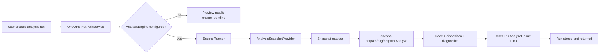

# NetPath Engine Runner Design

## Goal

Connect OneOPS NetPath analysis runs to the `oneops-netpath` path engine without coupling OneOPS directly to the engine's `internal` packages, while preserving a clean path for later DC2 route, ACL, NAT, and firewall policy facts.

## Current State

`oneops-netpath` already contains a working MVP forwarding engine:

- `internal/model` defines snapshots, devices, interfaces, route tables, links, flows, traces, hops, steps, and diagnostics.
- `internal/engine` performs route lookup, topology peer resolution, loop detection, no-route handling, null-route handling, connected-subnet delivery, and insufficient-information reporting.
- `cmd/netpathctl` can analyze JSON snapshots from local testdata.

OneOPS currently contains the platform-facing NetPath shell:

- `app/netpath/dto` defines preview and analysis DTOs.
- `app/netpath/service/impl` stores analysis run records in memory for the MVP.
- `app/netpath/snapshot` builds a preview snapshot from DC2 latest facts.
- The DC2 snapshot builder currently models devices, interfaces, links, and diagnostics. It does not yet include route tables, ACLs, NAT, PBR, or firewall policies.

## Key Constraint

OneOPS must not import `github.com/netxops/oneops-netpath/internal/...`.

Go's `internal` package rule prevents imports from outside the `oneops-netpath` module. The integration therefore needs a public boundary in `oneops-netpath`, or an out-of-process boundary such as CLI/HTTP.

## Recommended Approach: Public Go SDK + OneOPS Runner Interface

Expose a small public package in `oneops-netpath`:

```text
oneops-netpath/pkg/netpath
```

The package re-exports the stable model types and wraps `engine.Analyze`:

```go
package netpath

type Snapshot = model.Snapshot
type SourceRefs = model.SourceRefs
type Device = model.Device
type VRF = model.VRF
type Interface = model.Interface
type RouteTable = model.RouteTable
type Route = model.Route
type Link = model.Link
type Flow = model.Flow
type Options = model.Options
type AnalyzeRequest = model.AnalyzeRequest
type AnalyzeResponse = model.AnalyzeResponse
type Trace = model.Trace
type Hop = model.Hop
type Step = model.Step
type Diagnostic = model.Diagnostic

func Analyze(req AnalyzeRequest) (AnalyzeResponse, error) {
	return engine.Analyze(req)
}
```

In OneOPS, add an explicit runner seam:

```go
type AnalysisEngine interface {
	Analyze(ctx context.Context, req dto.AnalyzeRunCreateReq) (*dto.AnalyzeResult, string, error)
}
```

For the first OneOPS-side change, this engine seam should be implemented with a fake or fixture-backed runner in tests, not by changing `OneOPS/go.mod` to depend on a local `replace`. The service contract should become stable before OneOPS takes a module dependency on the standalone engine.

The runner also needs a separate snapshot-source contract. The current `SnapshotBuilder` is for previews and cannot fetch a full analysis snapshot by `SnapshotID`. The Engine Runner path should therefore model the distinction explicitly:

```go
type AnalysisSnapshotProvider interface {
	GetAnalysisSnapshot(ctx context.Context, tenantCode string, snapshotID string) (*AnalysisSnapshot, error)
}
```

The first provider can be in-memory or fixture-backed. A later provider can read DC2-normalized route, ACL, NAT, PBR, and firewall facts after those facts exist.

`NetPathService.CreateAnalyzeRun` uses the injected engine when configured, and keeps the current `engine_pending` preview result when no engine is configured. This keeps the API contract stable while allowing local tests, later DC2-backed snapshots, and future external engine processes to share the same service flow.

## Data Flow



For the first Engine Runner MVP, the runner should be pluggable and testable. It does not need to solve DC2 route-table extraction in the same change. A fixture or injected snapshot provider is enough to prove the platform can execute a real engine and persist a real result.

## Why Not CLI First

Calling `netpathctl` as a subprocess would avoid Go module wiring, but it would add operational friction:

- process execution and binary discovery become runtime concerns;
- JSON serialization becomes the integration contract before the Go API stabilizes;
- error handling and observability are harder to keep typed;
- tests become slower and more environment-dependent.

The CLI can remain useful for diagnostics and offline replay, but the platform should start with an in-process Go SDK boundary.

## Why Not Copy Engine Code Into OneOPS

Copying the engine into OneOPS would remove the module boundary problem, but it creates two sources of truth for routing behavior. The standalone engine should remain the canonical calculation core. OneOPS should own acquisition, storage, UX, permissions, workflow, and ticket closure.

## MVP Scope

In scope:

- Add public `pkg/netpath` API in `oneops-netpath`.
- Add OneOPS `AnalysisEngine` injection point.
- Add a OneOPS analysis snapshot provider contract, separate from preview snapshot building.
- Add a OneOPS engine adapter test path that can call a fake/fixture engine from a provided analysis snapshot.
- Map engine response into `dto.AnalyzeResult`.
- Preserve existing fallback behavior when no engine is configured.
- Add focused tests for SDK exposure, service fallback, engine success, and engine error handling.

Out of scope for this MVP:

- DC2 route-table extraction.
- ACL, PBR, NAT, or firewall-policy parsing.
- Probe Orchestrator.
- UI topology rendering.
- Durable database persistence of analysis runs.
- Publishing `oneops-netpath` as a remote module.
- Adding a local `replace` dependency from OneOPS to `../oneops-netpath`.

## DC2 Dependency

Engine Runner is related to DC2, but it should not be blocked by DC2.

DC2 is the source of collected facts. Snapshot Builder turns those facts into a normalized model. Engine Runner consumes a normalized path-analysis snapshot. The current DC2 builder can create topology previews, but useful forwarding analysis needs route tables at minimum. Therefore:

1. Engine Runner can be implemented now with an injected snapshot provider or fixture snapshot.
2. DC2 route facts should be added in the next snapshot-builder phase.
3. Firewall/PBR/ACL policy facts can be added after route-based path traversal is stable.

## Error Handling

The service should return a completed run with a meaningful disposition when the engine can classify the result, such as `no_route` or `insufficient_info`.

The service should return a failed run only when the runner itself fails, such as:

- snapshot provider returns an error;
- snapshot provider returns nil;
- SDK validation fails due to malformed input;
- mapper cannot convert an engine response.

Run-level `Disposition` should be derived deterministically from trace-level dispositions. In the MVP, the engine returns one trace, so the run disposition is the first trace disposition. If a future engine returns multiple traces, the runner must either set an explicit aggregate disposition or choose the first trace as the primary path and keep alternates in `Result.Traces`.

`SnapshotID` defaulting remains unchanged for API compatibility: when callers omit it, `CreateAnalyzeRun` sets `preview-{tenant}`. A real analysis snapshot provider should treat that as a lookup key and return a controlled error if no analysis snapshot exists. Preview snapshot IDs such as `dc2-preview-{tenant}` should not be silently assumed to be full analysis snapshots.

## Testing

`oneops-netpath` tests:

- public `pkg/netpath.Analyze` accepts an inline snapshot and returns the same route-based disposition as the internal engine.
- public type aliases allow callers to construct snapshots without importing `internal`.

OneOPS tests:

- default service still returns `engine_pending`.
- configured engine result replaces the preview result and sets the run disposition from the trace.
- engine error creates a failed run with the error message and no successful result.
- returned run objects remain cloned and isolated from caller mutation.
- analysis snapshot provider errors are surfaced as failed runs rather than preview-success runs.

## Acceptance Criteria

- OneOPS has a typed extension point for real path analysis.
- OneOPS can execute a real `oneops-netpath` engine result in tests.
- Existing API behavior remains compatible when no runner is configured.
- The implementation does not import `oneops-netpath/internal/...` from OneOPS.
- The implementation does not add a local module `replace` to OneOPS in this phase.
- The design leaves route/ACL/NAT/firewall policy acquisition as a separate snapshot-builder enhancement.
