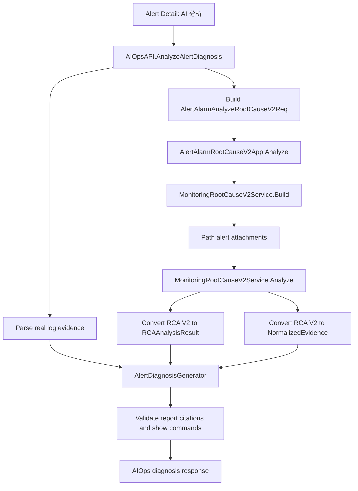

# OneOPS Alert AI Diagnosis RCA V2 Integration Design

## Purpose

This spec locks the confirmed方案 A: the alert detail page's "AI 分析" must reuse the same RCA V2 path that the alert page already uses for "故障定位".

The target closure is:

```text
告警详情 AI 分析
  -> /api/v1/aiops/alerts:diagnose
  -> AlertAlarmRootCauseV2App
  -> MonitoringRootCauseV2Service
  -> RCA V2 result converted into cited AI evidence
  -> real log evidence
  -> local Ollama structured report
  -> safety and citation validation
  -> read-only frontend report
```

The LLM does not replace RCA. RCA V2 remains the source of root-cause candidates; the LLM only explains, prioritizes, and turns cited evidence into a diagnosis report.

## Confirmed Decisions

- Architecture direction: use方案 A.
- AIOps calls `AlertAlarmRootCauseV2App` directly.
- The RCA service in scope is the current alert-page chain: `AlertAlarmRootCauseV2App -> MonitoringRootCauseV2Service`.
- The older `pkg/rca2` and `pkg/rca3` contracts are not the runtime path for the alert detail page and are not the integration target for this slice.
- If RCA V2 fails, AI diagnosis still runs with real log evidence and returns a partial report.
- MVP remains read-only. Suggested commands may only be displayed as approved `show` candidates; no command execution is added in this slice.

## Current State

The alert page currently has two adjacent but disconnected experiences:

- "故障定位" calls `/alert/alarm/root-cause-v2/analyze`.
- "AI 分析" calls `/aiops/alerts:diagnose`.

The active alert RCA path is:

```text
OneOPS-UI/src/views/alert/Alarm.vue
  -> OneOPS-UI/src/views/alert/alarm_rca.ts
  -> OneOPS-UI/src/api/alert/alert_alarm.ts
  -> POST /alert/alarm/root-cause-v2/analyze
  -> OneOPS/app/alert/api/alert_alarm_root_cause_v2.go
  -> OneOPS/app/alert/service/impl/alert_alarm_root_cause_v2_app.go
  -> OneOPS/app/platform/service/impl/monitoring_root_cause_v2_service.go
```

The current AI diagnosis endpoint parses uploaded log samples and calls the local LLM generator, but its RCA input is still a placeholder:

```go
RCA: aiopsDTO.RCAAnalysisResult{
    Conclusion: "rca_not_connected_in_alert_diagnosis_mvp",
}
```

This spec replaces that placeholder with the real RCA V2 result and converts RCA output into normal evidence that can be cited by the generated report.

## Architecture

### Backend Flow



### Dependency Boundary

`AIOpsAPI` will depend on `alertService.IAlertAlarmRootCauseV2App`.

This is an intentional module dependency for this slice because the alert module already owns the stable RCA V2 orchestration needed by the alert page. AIOps should not duplicate the build/analyze wiring, path alert attachment behavior, tenant normalization, or configured monitor fallback logic.

The implementation must keep the dependency narrow:

- Inject the interface `IAlertAlarmRootCauseV2App`, not the concrete app.
- Keep conversion from platform DTO to AIOps DTO inside AIOps-owned helper code.
- Avoid changing the alert page's existing "故障定位" behavior.

## Request Mapping

`AlertDiagnosisReq` is mapped to `AlertAlarmAnalyzeRootCauseV2Req` as follows:

| AIOps field | RCA V2 field | Rule |
| --- | --- | --- |
| `request_id` | `request_id` | Pass through when present. |
| `tenant_id` | `tenant_code` | Use as tenant code because alert RCA V2 normalizes tenant identifiers internally. |
| `observed_at` | `observed_at` | Pass through. |
| `alert_id` | `current_alert_code` | Pass through. |
| `target.id` | `target_id` | Required for RCA V2 execution. |
| `metadata["monitor_id"]` | `monitor_id` | Optional. If missing, `AlertAlarmRootCauseV2App` may use tenant config fallback. |

`alert_codes` is not set by default in this slice. The alert RCA app already discovers related path alerts after topology/path resolution.

If `target.id` is missing, AI diagnosis should not call RCA V2. It should continue with log evidence and mark RCA as unavailable because the frontend request builder can be improved independently.

## RCA Result Mapping

`MonitoringRootCauseV2AnalyzeResp` is converted into `aiopsDTO.RCAAnalysisResult`.

Mapping:

- `Conclusion`: `monitoring_root_cause_v2_completed`
- `Reasons`: union of `final_decision.reasons` and every `analyses[].reasons`
- `Candidates`: from `final_decision.candidates`
  - `object_ref.object_type` -> `ObjectRef.Type`
  - `object_ref.object_id` -> `ObjectRef.ID`
  - `role` -> `Role`
  - `score` -> `Score`
  - `reasons` -> `Reasons`

If RCA V2 returns no final candidates, the conversion still marks the result as completed but includes a reason indicating that RCA V2 completed without final candidates. This helps the report distinguish "RCA unavailable" from "RCA ran but found no strong candidate".

## RCA Evidence Mapping

RCA V2 output is also converted into `[]NormalizedEvidence` so the LLM can cite concrete RCA facts using the same citation contract already enforced for logs.

Evidence kinds:

- `rca_candidate`: one item per final RCA candidate.
- `rca_analysis`: one item per non-empty analysis scope.
- `rca_path`: one item per path in `execution.path_sets`.
- `rca_attachment`: one item per attachment in `execution.attachments`.

Stable IDs:

- Candidate: `rca:v2:candidate:<object_type>:<object_id>`
- Analysis: `rca:v2:analysis:<scope-or-index>`
- Path: `rca:v2:path:<path_set_id>:<path_id>`
- Attachment: `rca:v2:attachment:<attachment_id-or-hash>`

Evidence summaries must be human-readable and compact. Examples:

- `RCA V2 final candidate node device-01 scored 85 as suspected_root because interface-down alert is attached to the path target.`
- `RCA V2 path monitor-a -> device-01 includes 4 hops.`
- `RCA V2 attachment alert/path-alert on node device-01: Interface Gi1/0/24 down.`

The evidence converter must not embed raw large payloads. It should keep raw RCA DTOs out of the LLM prompt except through bounded normalized evidence fields.

## Failure And Degradation

RCA V2 is useful but not mandatory for AI diagnosis.

If RCA cannot be called because the dependency is nil, target id is missing, topology path is empty, tenant/monitor lookup fails, or platform RCA returns an error:

- Log the RCA failure through the existing API logger when available.
- Continue generating the AI diagnosis using available real log evidence.
- Set `RCAAnalysisResult.Conclusion` to `monitoring_root_cause_v2_unavailable`.
- Add the failure reason to `RCAAnalysisResult.Reasons`.
- Add one server-generated evidence item of kind `rca_status` with a stable id such as `rca:v2:status:unavailable`.

The report generator can then produce `status=partial` and cite the RCA status evidence if it mentions RCA unavailability.

The endpoint should still fail when:

- The user request is invalid.
- No LLM provider is available.
- The LLM output is not valid JSON.
- The generated report violates citation or safety constraints.

## Safety Contract

The existing safety model remains unchanged:

- Every fact and recommendation must cite known server evidence.
- The server rewrites citation source/ref/type from `NormalizedEvidence`; client or model-forged citation metadata is rejected.
- Only read-only `show` commands may appear in `suggested_show`.
- `show running-config`, `show tech-support`, pipes, redirects, shell substitutions, and side-effect commands remain blocked.
- `suggested_show` must have `requires_approval=true`.
- The frontend displays suggestions only; it does not execute them.

RCA V2 evidence must pass through the same citation binding path as log evidence. There is no separate trust shortcut for RCA text produced by the backend.

## Frontend Impact

No first-slice UI shape change is required.

The existing AI diagnosis drawer continues to show:

- summary
- facts
- root-cause candidates
- troubleshooting steps
- recommendations
- missing evidence
- citations
- read-only suggested `show` commands

The frontend request builder should keep sending `target.id`, `tenant_id`, `observed_at`, `alert_id`, and metadata. A later UI polish slice may show "RCA V2 已接入 / RCA V2 不可用" as a visible status, but that is not required for the backend integration.

## Test Strategy

### Unit Tests

Backend tests must cover:

- Request mapping from `AlertDiagnosisReq` to `AlertAlarmAnalyzeRootCauseV2Req`.
- Successful RCA V2 conversion into `RCAAnalysisResult`.
- RCA candidate/path/attachment conversion into stable `NormalizedEvidence`.
- RCA failure degradation still calls `AlertDiagnosisGenerator`.
- Missing target id skips RCA and degrades instead of failing the full endpoint.
- Generated reports can cite RCA evidence and pass `ValidateDiagnosisReport`.
- Forged RCA citations are rejected by existing evidence binding.

### Smoke Tests

The longest-chain smoke should cover:

```text
frontend request builder
  -> backend diagnosis API handler with stubbed AlertAlarmRootCauseV2App
  -> RCA V2 candidate/evidence conversion
  -> real uploaded log evidence parsing
  -> local Ollama strict JSON report
  -> citation binding
  -> show command whitelist
```

A full live browser click is not required for this slice unless the local OneOPS service stack is already running with usable auth and DB state.

### Uncovered Nodes To Keep Explicit

These remain outside the first RCA V2 integration proof unless separately prepared:

- Full authenticated live `/api/v1/aiops/alerts:diagnose` route.
- Browser click on a real alert record.
- DB-backed LLM provider configuration.
- Real Loki or production log-system retrieval.
- Private knowledge/RAG ingestion.
- Device command execution.
- Audit persistence.

## Acceptance Criteria

- The AI diagnosis backend no longer uses `rca_not_connected_in_alert_diagnosis_mvp` when RCA V2 can be invoked.
- The AIOps endpoint calls `AlertAlarmRootCauseV2App.Analyze` with mapped alert context.
- RCA V2 final candidates appear in `RCAAnalysisResult`.
- RCA V2 candidates, analyses, paths, and attachments can be cited as `NormalizedEvidence`.
- RCA failure degrades to partial analysis instead of failing the whole endpoint.
- Existing log evidence parsing and Ollama diagnosis generation continue to work.
- Existing show-only safety gates remain enforced.
- Frontend "AI 分析" remains read-only and does not add device command execution.

## Implementation Boundaries

Do not add a new RCA engine.

Do not switch the alert page from RCA V2 to `pkg/rca2` or `pkg/rca3`.

Do not introduce Dify, RAGFlow, Open WebUI, AnythingLLM, or another service as a required dependency for this slice.

Do not implement autonomous remediation or show-command execution.

Do not broaden the AI prompt with raw unbounded RCA payloads.

## Next Step

After this spec is reviewed, write an implementation plan under `docs/superpowers/plans/2026-06-19-alert-ai-diagnosis-rca-v2-integration.md`.

The implementation plan should use small TDD tasks and can be executed with subagent-driven development using `gpt-5.4`, as requested.
