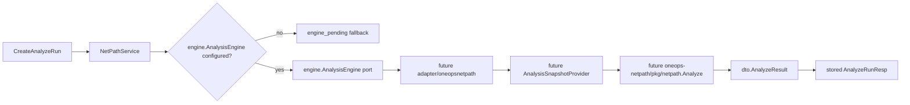

# OneOPS NetPath Engine Port Design

## Goal

Prepare OneOPS for a real `oneops-netpath` SDK adapter without committing a local module `replace` or pretending that the current DC2 preview snapshot is a full analysis snapshot.

## Current State

`oneops-netpath` now exposes a public SDK package:

- `github.com/netxops/oneops-netpath/pkg/netpath`
- public aliases for the path-analysis model;
- `Analyze(req AnalyzeRequest) (AnalyzeResponse, error)`;
- disposition constants using the `Disposition...` naming convention.

OneOPS currently has a service-local engine seam:

- `AnalysisEngine` is defined in `app/netpath/service/impl/netpath.go`;
- `WithAnalysisEngine` injects it into `NetPathService`;
- the service keeps `engine_pending` fallback when no engine is configured;
- engine failures and incomplete results are stored as failed runs.

OneOPS DC2 snapshot preview currently models:

- devices;
- interfaces;
- links;
- diagnostics.

It does not model route tables, ACL, NAT, PBR, or firewall policies. It should not be used as a path-analysis snapshot yet.

## Key Constraints

Do not commit an active local dependency such as:

```text
replace github.com/netxops/oneops-netpath => ../oneops-netpath
```

The existing `OneOPS/go.mod` keeps similar local `replace` entries commented out. That suggests local replaces are developer-only switches, not shared repository state.

Do not import `oneops-netpath/pkg/netpath` in OneOPS until dependency strategy is explicit. For the next implementation slice, OneOPS should define stable ports and keep adapter placement ready.

Do not wire the current DC2 preview `SnapshotBuilder` into analysis execution. Preview snapshots lack route tables, so doing so would create a path that compiles but cannot produce useful routing analysis.

## Recommended Approach

Move the engine port out of `service/impl` into a focused package:

```text
app/netpath/engine
```

The package owns the analysis execution contract and should not depend on API DTOs:

```go
package engine

import "context"

type AnalysisEngine interface {
	Analyze(ctx context.Context, req AnalyzeRequest) (*AnalyzeResult, error)
}

type AnalyzeRequest struct {
	TenantCode        string
	SnapshotID        string
	SrcIP             string
	DstIP             string
	Protocol          string
	SrcPort           int
	DstPort           int
	IngressDeviceCode string
	IngressInterface  string
	IngressVRF        string
	BusinessLabel     string
}

type AnalyzeResult struct {
	SnapshotID  string
	Flow        Flow
	Disposition string
	Traces      []Trace
	Diagnostics []Diagnostic
}
```

The result-level `Disposition` is the single run-level disposition source. Trace dispositions remain trace details and should not be used as a fallback for the run disposition.

Then make `NetPathService` depend on `engine.AnalysisEngine` instead of a private interface. The service maps API DTOs to engine port types before calling the engine, then maps engine results back to API DTOs for response storage. This keeps future concrete adapters from being coupled to external API schemas.

## Future Adapter Placement

When dependency strategy is ready, put the concrete SDK bridge under:

```text
app/netpath/adapter/oneopsnetpath
```

That adapter will own:

- `AnalyzeRunCreateReq -> netpath.Flow`;
- `AnalysisSnapshotProvider -> netpath.Snapshot`;
- `netpath.Analyze(...) -> dto.AnalyzeResult`;
- SDK validation errors and mapping errors.

## Snapshot Provider Direction

The future adapter should consume an analysis snapshot provider, but this implementation slice should only document the boundary and avoid importing the SDK:

```go
type AnalysisSnapshotProvider interface {
	GetAnalysisSnapshot(ctx context.Context, tenantCode string, snapshotID string) (any, error)
}
```

Once `oneops-netpath` is a real OneOPS dependency, the provider return type can become `netpath.Snapshot`. The eventual adapter package should keep that SDK type local to the adapter boundary and not expose it in API DTOs or database models.

## Data Flow



## MVP Scope

In scope:

- create `app/netpath/engine`;
- move the `AnalysisEngine` interface into that package with independent request/result types;
- update `service/impl` to use `engine.AnalysisEngine`;
- add mapper helpers between service DTOs and engine port types;
- keep `WithAnalysisEngine` as the public option on the service implementation;
- update tests to import the port package if needed;
- verify fallback, success, failure, nil result, empty disposition, and clone-isolation tests still pass.

Out of scope:

- adding `oneops-netpath` to `OneOPS/go.mod`;
- adding an active `replace`;
- creating `go.work`;
- implementing the concrete SDK adapter;
- implementing DC2 route-table, ACL, NAT, PBR, or firewall-policy extraction;
- changing API DTOs or persistent run models.

## Acceptance Criteria

- `AnalysisEngine` is no longer private to `service/impl`.
- `NetPathService` depends on `app/netpath/engine.AnalysisEngine`.
- `app/netpath/engine` does not import `app/netpath/dto`.
- Run-level disposition comes from `engine.AnalyzeResult.Disposition`.
- Existing NetPath service/API behavior remains unchanged.
- No active `oneops-netpath` dependency is added to `OneOPS/go.mod`.
- Tests pass for OneOPS NetPath packages and race test for `service/impl`.
