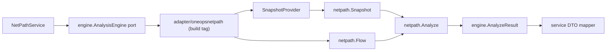

# OneOPS NetPath SDK Adapter Design

## Goal

Add a safe path for a future OneOPS adapter that calls `oneops-netpath/pkg/netpath`, without breaking default OneOPS builds and without committing a local `replace` dependency.

## Current State

OneOPS now has a stable engine port:

```text
app/netpath/engine
```

The port uses OneOPS-owned request/result types and no longer imports API DTOs. `NetPathService` maps API DTOs to this port and stores mapped results.

`oneops-netpath` now has a public SDK:

```text
github.com/netxops/oneops-netpath/pkg/netpath
```

The SDK is usable locally, but OneOPS does not have a committed dependency on that module. `oneops-netpath` also does not yet have a tagged version suitable for a reproducible `require`.

## Problem

A normal OneOPS adapter file such as:

```go
import "github.com/netxops/oneops-netpath/pkg/netpath"
```

would require either:

- a committed module dependency; or
- a committed local `replace`; or
- a `go.work` file available in every build environment.

The first is not ready, the second would bake a developer-local path into shared repo state, and the third is a local workspace convenience rather than an application dependency contract.

## Recommended Approach

Use a build-tagged adapter package:

```text
app/netpath/adapter/oneopsnetpath
```

Default files:

- build in normal OneOPS commands;
- do not import `oneops-netpath`;
- document how to enable the SDK adapter.

SDK files:

- guarded by `//go:build oneops_netpath_sdk`;
- import `github.com/netxops/oneops-netpath/pkg/netpath`;
- implement `app/netpath/engine.AnalysisEngine`;
- are compiled only when local developers explicitly opt in.

This lets OneOPS carry the adapter source without forcing all environments to resolve the standalone module before the dependency strategy is settled.

The scaffold is intentionally dormant. It is not wired into production dependency injection, and it does not make `CreateAnalyzeRun` work against live DC2 facts by itself.

## Local Development Flow

For local SDK adapter verification:

```bash
cd /Users/huangliang/project/OneOPS-ALL
go work init ./OneOPS ./oneops-netpath
GOWORK=/Users/huangliang/project/OneOPS-ALL/go.work \
  go test -tags oneops_netpath_sdk ./OneOPS/app/netpath/adapter/oneopsnetpath
```

`go.work` should remain a local workspace file unless the team chooses to standardize on it. Do not commit `go.work` as part of the adapter slice.

## Adapter Contract

The adapter package should expose a small constructor:

```go
func New(provider SnapshotProvider) engine.AnalysisEngine
```

`SnapshotProvider` is local to the adapter package:

```go
type SnapshotProvider interface {
	GetSnapshot(ctx context.Context, req engine.AnalyzeRequest) (netpath.Snapshot, error)
}
```

`SnapshotProvider` must return a complete engine-ready `netpath.Snapshot`, including route tables for non-trivial path analysis. The current OneOPS preview `SnapshotBuilder` is not a valid provider for this adapter.

The adapter:

1. receives `engine.AnalyzeRequest` from OneOPS service;
2. loads an engine-ready `netpath.Snapshot` from the provider;
3. converts the request to `netpath.Flow`;
4. calls `netpath.Analyze`;
5. converts `netpath.AnalyzeResponse` to `engine.AnalyzeResult`.

Disposition aggregation for the MVP:

- `netpath.AnalyzeResponse.Traces[0]` is the primary path;
- `engine.AnalyzeResult.Disposition` is copied from the primary trace disposition;
- no traces or an empty primary trace disposition is an adapter error.

The adapter should not call the current DC2 preview `SnapshotBuilder`, because that preview model lacks route tables.

## Data Flow



## Error Handling

The adapter returns errors for:

- nil or missing snapshot provider;
- snapshot provider failure;
- empty snapshot ID after provider resolution;
- SDK validation errors from `netpath.Analyze`;
- SDK responses with no traces or empty primary trace disposition.

`NetPathService` already stores engine errors as failed runs, so adapter errors should remain ordinary Go errors.

## MVP Scope

In scope:

- create `app/netpath/adapter/oneopsnetpath/doc.go` with default build documentation;
- create build-tagged adapter implementation files;
- create build-tagged adapter tests using an in-memory snapshot provider and a fixture-style `netpath.Snapshot`;
- document local `go.work` verification command.

Out of scope:

- committing `go.work`;
- adding `oneops-netpath` to `OneOPS/go.mod`;
- adding active `replace` to `OneOPS/go.mod`;
- wiring adapter into production dependency injection;
- reading DC2 route facts;
- using preview snapshot builder for analysis.

## Acceptance Criteria

- Default OneOPS NetPath tests pass without `oneops-netpath` dependency.
- Default `go test ./app/netpath/...` does not compile SDK-tagged files.
- SDK adapter tests pass locally when run with `-tags oneops_netpath_sdk` and a local workspace that includes `oneops-netpath`.
- No `go.mod`, `go.sum`, or active `replace` changes are committed.
- Adapter maps request, flow, traces, hops, steps, diagnostics, details, and run disposition.
- Adapter requires a snapshot provider and never synthesizes an analysis snapshot from preview-only DC2 facts.
