# 设备入库、采集和监控纳管使用手册

这份手册带你完成一台设备从进入 OneOps，到采集设备信息，再到下发监控任务的主流程。第一次使用时，建议先按单台设备走通，再使用批量操作。

## 1. 首次使用先看

你会完成什么：
先分清入库、采集和监控纳管三件事，避免把“设备出现在列表里”误认为“已经开始监控”。

开始前确认：
- 你可以使用管理员分配的账号登录 OneOps。
- 你知道要接入哪一台设备。
- 如果外部平台已经有设备编号，可以沿用这个编号。

操作步骤：
1. 打开 OneOps 地址。如果被带到登录页，先输入账号和密码登录。
2. 先把设备入库。入库表示 OneOps 有了这台设备的资产记录。
3. 再执行采集。采集表示 OneOps 去读取设备信息，例如基础属性、接口信息或配置摘要。
4. 最后执行监控纳管。监控纳管表示平台把监控任务下发到可用的执行目标，让设备进入监控范围。
5. 监控推送成功后，到监控任务管理完成对账。对账完成后，再回到设备详情等待运行态刷新。
6. 上传或入库成功后不要停在导入页。必须回到设备清单继续做采集或监控纳管，才算完成一次接入验证。网络设备如果导入时已经提供平台、设备类别和可用 SNMP 凭据，可以不先采集，直接发起监控纳管。

术语先说明：
- 执行目标是实际执行采集或监控下发的服务、节点或 Agent。
- Agent 是部署在指定环境中的执行程序，负责代替平台访问设备或下发任务。
- SSH 和 SNMP 是常见的设备访问方式，前者通常用于登录设备，后者通常用于读取设备状态。

怎么看是否成功：
- 设备入库后，你能在设备清单中找到这台设备。
- 采集成功后，你能看到采集结果、采集时间、结构化结果或采集详情。采集详情可以在采集过程中查看，也可以在设备详情中查看。
- 监控纳管成功后，你能看到监控下发结果，并能在监控任务管理里完成对账。
- 运行态正常后，设备详情中会显示“监控已下发”和“运行正常”。

如果失败：
- 不要先刷新很多次。先打开结果抽屉或任务详情，看失败原因。
- 如果提示资料不全，先按页面提示补充设备资料。
- 如果提示检测错误，优先检查设备登录方式、账号、密码或 SNMP 信息是否正确。
- 如果不是资料或账号问题，可以下载诊断日志，交给平台管理员或支持人员分析。

截图：
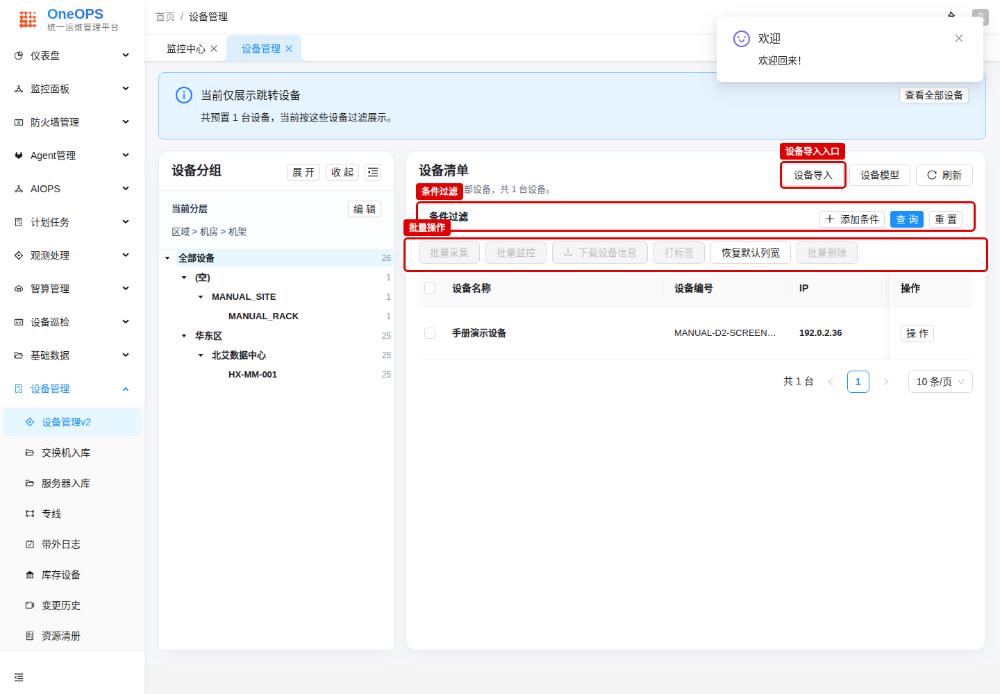

图中红框标出设备导入入口、条件过滤区和批量操作区。

## 2. 准备设备资料

你会完成什么：
准备好后续入库、采集和监控需要用到的设备信息。

开始前确认：
- 如果外部平台已经有设备编号，可以沿用这个设备编码，便于后续和外部平台对账。
- 设备名称不是必填项，但建议提供。没有设备名称时，系统会默认用设备编码作为设备名称，后续辨识度会差一些。
- 你知道设备 IP，至少有一个可访问地址。
- 不需要提前知道设备类型、平台等信息，系统会在采集过程中自动识别和补充。
- 如果是网络设备，SNMP 是监控纳管的必备信息。只准备 SNMP，并且导入时已经提供平台和设备类别，也可以先完成监控纳管。
- 直接监控网络设备时，先确认 SNMP 凭据确实属于目标设备。默认 SNMP 凭据只有在现场统一使用同一套 SNMP 参数时才适合选择。
- 网络设备的 SSH 账号主要用于配置管理、自动化等功能。
- 如果是服务器，SSH 是必备信息。
- 凭据有两种准备方式。安全要求高的用户，先在统一凭证工作台录入凭据，再在导入清单里填写凭据引用。安全敏感度不高、希望少走几步的用户，可以直接在导入清单里填写用户名、密码、SNMP Community、SNMPv3 账号、IPMI 或 Redfish 账号，平台会在入库时自动创建凭据并写回设备引用。

操作步骤：
1. 把设备基础信息整理到一处：设备编码、IP、所属组织或分组。设备名称建议一起准备，方便后续识别。
2. 选一种凭据准备方式：高安全场景先到统一凭证工作台创建凭据并记录凭据 Code；普通导入场景可以把账号密码填在清单对应列里，让平台代建凭据。SSH 凭据通常用于带内登录，SNMP 凭据通常用于监控和状态读取。
3. 把访问方式整理清楚：网络设备重点确认 SNMP；需要配置管理或自动化时再准备 SSH；服务器需要准备 SSH。网络设备想跳过采集直接监控时，还要提前准备平台和设备类别，并确认 SNMP 凭据适用于这台设备。
4. 确认凭据只保存在平台允许的位置，不要把密码写进手册、备注或截图。

怎么看是否成功：
- 你能回答“这台设备用哪个地址访问”“沿用哪个设备编号”“用 SNMP 还是 SSH 访问”。
- 如果准备直接监控网络设备，你还知道它的平台和设备类别。

如果失败：
- 缺 IP 或凭据时，先不要继续采集。
- 不确定设备类型时，不需要在这一步卡住。先入库并采集，让系统识别后再处理页面提示的问题。

## 3. 导入或创建设备

你会完成什么：
把设备加入 OneOps，并能在设备清单中看到它。

开始前确认：
- 已准备好设备基础信息。
- 你有设备管理权限。
- 如果外部平台已有设备编码，建议直接沿用。

操作步骤：
1. 打开 `/#/device/device-v2-management`。
2. 点击“设备导入”。
3. 页面会进入 `/#/device/device-v2-ingest-pipeline-redesign`，标题是“导入设备清单”。
4. 如果只新增一台，点击“新增一台设备”，在草稿里补字段后点击“提交到设备清册”。
5. 如果从 Excel 导入，点击“下载导入模板”，按实际场景选择模板后填写并上传：
   - 全量字段模板：适合一次性补齐更多字段，包含凭证引用、账密和扩展字段。
   - 凭证引用模板：适合统一凭证已准备好的场景，只填写凭证引用，不填写账号密码。
   - 账密模板：适合直接登记账号密码的场景，只填写账号密码，不填写凭证引用。
   上传 Excel 会直接创建入库任务，不需要再点一次“提交到设备清册”。
6. 上传完成后查看“最近提交结果”或“设备导入结果”，确认新增、更新、失败和信息问题数量。如果页面没有逐行明细，优先看入库结果里的新增、更新、失败数量，再回设备清单用 IP 或业务编码搜索确认。
7. 点击“查看设备清册”或回到 `/#/device/device-v2-management`，用设备编码、名称或 IP 查询。
8. 找到刚入库的设备后，继续执行采集或监控纳管。导入成功只表示资产已经进入设备清册，不表示已经完成采集或监控。网络设备如果已经有平台、设备类别和 SNMP 凭据，可以直接进入监控纳管。

Excel 文件要求：
- 优先使用下载的标准模板。标准模板的 Sheet 名是 `devices`。
- 第一行可以使用 Device V2 支持的字段 key，例如 `biz_code`、`biz_name`、`in_band_ip`、`tenant_name`、`region_name`。
- 至少保留 2 个可识别字段，并且至少有 1 个定位字段：`biz_code`、`sn`、`asset_number`、`in_band_ip`、`out_band_ip`、`hostname`。
- 常见中文表头也可以直接上传，例如 `区域`、`机房`、`机柜`、`带内管理网IP`、`带内用户名`、`带内密码`、`带内Community`。页面会先转换成 Device V2 字段再提交。

从客户已有设备清单中选设备导入时，按下面映射整理：

| 原文件列 | 导入模板列 | 填写说明 |
| --- | --- | --- |
| 区域 | `region_name` | 例如所属区域。必须能匹配系统里的区域主数据。 |
| 机房 | `site_name` | 例如主机房。必须能匹配系统里的站点主数据。 |
| 机柜 | `rack_name` | 例如机柜编号。必须能匹配系统里的机柜主数据。 |
| 机架号 | `rack_position` | 例如所在 U 位。 |
| 归属类别 | `remark` | 先写入备注；如果页面提供设备类别或功能域字段，再按现场要求补充。 |
| 租户 | `tenant_name` | 填写设备所属租户。 |
| 带内管理网IP | `in_band_ip` | 这是最常用定位字段。 |
| 带内用户名 | `in_band_username` | 仅在“文件里带账号密码”方式填写。 |
| 带内密码 | `in_band_password` | 仅在“文件里带账号密码”方式填写，不要写进备注。 |
| 带内Community | `snmp_community` | SNMPv2c 常用；同时填写 `snmp_plane` 和 `snmp_version`。 |
| 平台 | `platform_code` | 想跳过采集直接监控时建议填写。必须能匹配系统里的平台主数据。 |
| 设备类别 | `catalog_code` | 想跳过采集直接监控时建议填写。必须能匹配系统里的设备类别主数据。 |
| 登录方式 | `login_method` | 常见值是 `ssh` 或 `telnet`。 |
| 登录端口 | `login_port` | SSH 通常是 22。 |
| 虚拟区域 | `remark` | 先写入备注；如果页面提供功能域字段，再按现场要求补充。 |

原文件没有设备编码和设备名称，建议额外补两列：
- `biz_code`：建议使用稳定规则，例如 `DEV-001` 或外部平台已有编号。
- `biz_name`：建议组合设备位置或用途，例如 `核心交换机-1`。

凭据方式 A：先手动创建凭据再导入。
1. 打开 `/#/setting/credential-unified`。
2. 新增 SSH 凭据，按页面要求填写类型、用途、账号和密码，记录生成的凭据 Code。
3. 新增 SNMP 凭据，按现场使用的 SNMP 版本填写 Community 或账号信息，记录生成的凭据 Code。
4. 在导入模板中填写 `credential_ref_in_band` 和 `snmp_credential_ref`。
5. 不要再填写明文密码列，避免同一行出现两套来源。

凭据方式 B：在导入文件里给出账号密码。
1. SSH 填 `in_band_username`、`in_band_password`。
2. SNMPv2c 填 `snmp_plane=in_band`、`snmp_version=2c`、`snmp_community`。
3. 上传后平台会自动创建凭据目录项，并把生成的 `credential_ref_in_band`、`snmp_credential_ref` 写回设备属性。
4. 上传后以入库结果和设备详情中的凭据引用为准。如果入库结果提示凭据缺失，先检查账号、密码或 Community 是否填在模板专用列里。

网络设备直接监控的导入要求：
- 至少提供设备定位字段，例如业务编码或带内 IP。
- 提供 SNMP 凭据，或者提供 `snmp_credential_ref`。
- 提供平台和设备类别，例如 `platform_code`、`catalog_code`。
- 导入成功后可以直接发起监控纳管；采集仍然可以稍后再做，用于补充接口、配置或更多设备详情。

截图：
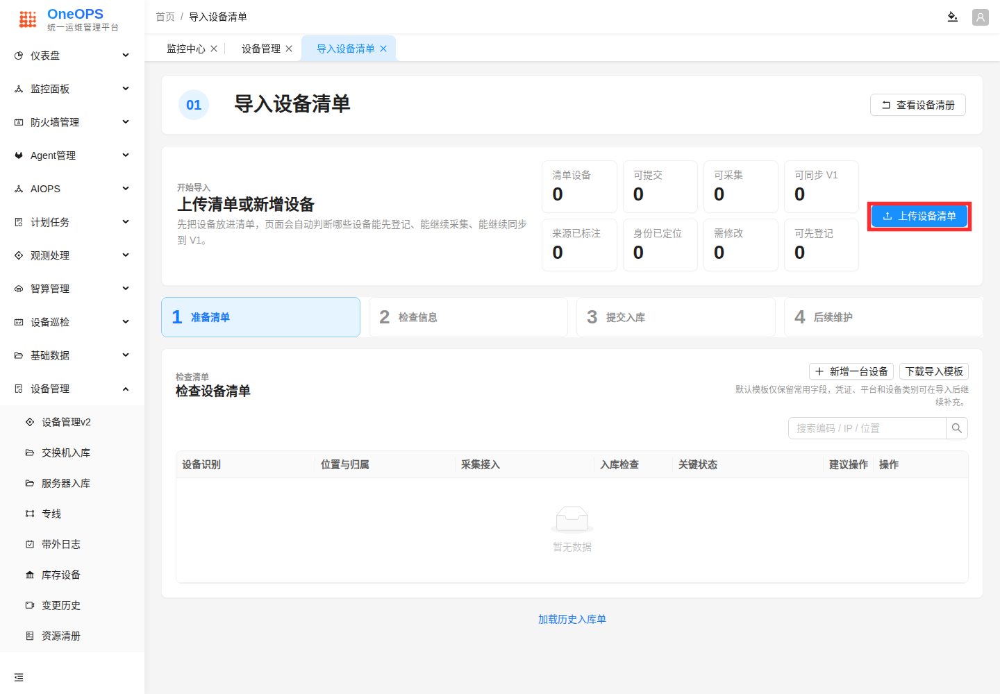

图中红框标出“上传设备清单”入口。

怎么看是否成功：
- 设备清单中能搜索到这台设备。
- 列表中显示设备编码、名称或 IP 等基础信息。
- 导入表里的 `biz_code` 是业务编码；设备详情页可能还会显示系统生成的设备 Code，二者不是同一个字段。找设备时优先用 IP、业务编码或设备名称搜索。

如果失败：
- 先查看页面提示的失败原因。
- 如果是必填字段缺失，优先补齐设备编码、名称、IP 或页面明确要求的字段后再提交。
- 如果账号密码列填写后仍提示没有凭据，先确认对应用户名和密码是否都填写在模板的专用列里，不要填到备注或普通属性列。
- 如果是重复设备，先确认是否已经存在，不要重复创建。

## 4. 在设备清单中找到设备

你会完成什么：
用搜索或筛选找到刚入库的设备，并确认它是下一步要操作的目标。

开始前确认：
- 设备已经提交入库。
- 你知道设备编码、名称或 IP 中的至少一个。

操作步骤：
1. 打开 `/#/device/device-v2-management`。
2. 在查询区域添加设备编码、名称或 IP 条件。
3. 点击“查询”。
4. 在结果列表中确认设备信息。

截图：
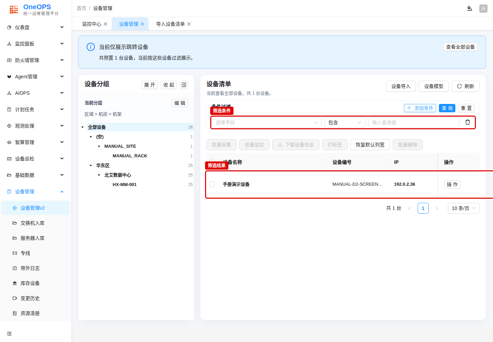

图中红框标出筛选条件、查询按钮和命中的设备行。

怎么看是否成功：
- 列表中只出现目标设备，或目标设备在结果中清楚可见。

如果失败：
- 换用设备编码、IP、名称分别查询。
- 如果仍然查不到，回到导入结果确认设备是否提交成功。

## 5. 执行设备采集

你会完成什么：
对单台设备发起采集，让平台读取这台设备的可用信息。

开始前确认：
- 设备在清单中可见。
- 设备 IP 和访问凭据已经尽量补齐。
- 网络设备至少准备 SNMP；服务器至少准备 SSH。
- 网络和端口允许平台或执行目标访问设备。
- 如果网络设备导入时已经提供平台、设备类别和可用 SNMP 凭据，可以先跳过采集，直接执行监控纳管。采集用于补充设备详情，不是这类直推监控的必经步骤。
- 已经采集过的设备也可以再次采集。再次采集会重新发起任务，并用新的结果更新采集信息。不建议短时间内频繁重复操作，但一般不会造成额外风险。

操作步骤：
1. 在设备清单中找到目标设备。
2. 点击该行的“操作”。
3. 点击“采集”。
4. 等待采集结果抽屉打开或任务状态刷新。

截图：
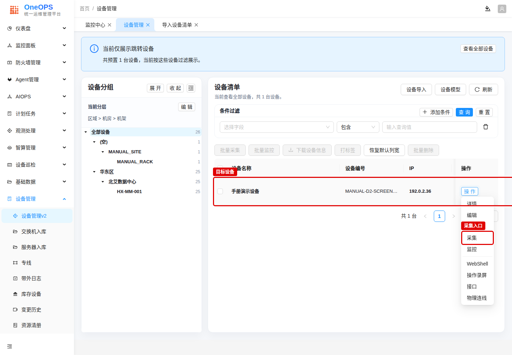

图中红框标出目标设备和“采集”菜单项。

怎么看是否成功：
- 采集结果中显示成功、完成时间或结构化采集结果。
- 采集的结果和详细信息可以在采集时查看，也可以在设备详情中查看。

如果失败：
- 打开采集结果抽屉查看失败说明。
- 如果提示资料不全，先按提示补充资料。
- 如果提示检测错误，先检查设备登录方式、账号、密码或 SNMP 信息。
- 如果仍然无法判断原因，下载诊断日志，交给平台管理员或支持人员分析。

## 6. 查看采集结果和采集日志

你会完成什么：
确认采集是否完成，并知道失败时去哪里看详情。

开始前确认：
- 已经发起过采集。

操作步骤：
1. 查看采集结果抽屉中的设备采集结果。
2. 如果有“查看详情”，点击后查看当前设备的结构化采集结果。
3. 如果需要排障，下载采集日志。

截图：
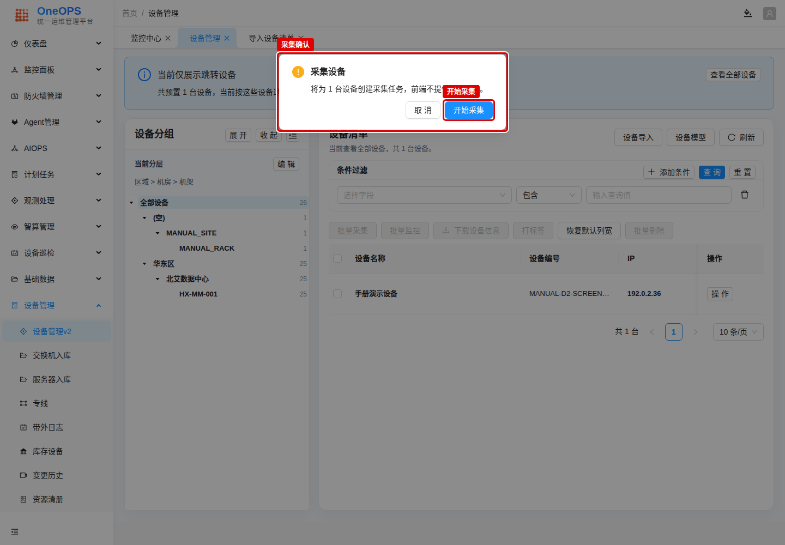

图中红框标出采集确认弹窗和“开始采集”按钮。

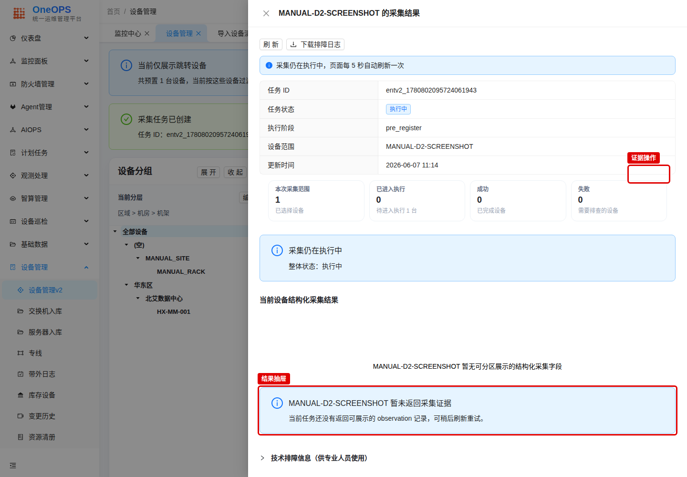

图中红框标出采集结果抽屉中的状态、证据入口和结果摘要。

怎么看是否成功：
- 你能看到采集状态、采集时间、协议或结果说明。
- 有结构化结果时，可以看到平台整理后的设备信息。
- 采集详情也可以从设备详情页再次打开，不必只在采集当时查看。

如果失败：
- 先读错误说明，不要只看“失败”两个字。
- 如果提示资料不全，补齐设备资料后重新采集。
- 如果提示检测错误，检查登录方式、账号、密码或 SNMP 信息是否正确。
- 如果是其它原因，下载诊断日志，交给平台管理员或支持人员分析。

## 7. 执行监控纳管

你会完成什么：
对设备发起监控下发，让它进入平台监控范围。

开始前确认：
- 设备已经入库。
- 建议先完成一次采集；但网络设备如果导入时已经提供平台、设备类别和可用 SNMP 凭据，可以直接监控。
- 网络设备需要准备 SNMP，且需要平台和设备类别才能推送监控任务。
- 推送前确认当前绑定的 SNMP 凭据属于目标设备。默认 SNMP 凭据可以使用，但前提是它确实适用于这台设备。
- 网络设备的 SSH 账号用于配置管理、自动化等功能；服务器需要准备 SSH。
- 已经推送过监控的设备也可以再次执行监控。再次执行会重新触发监控下发，用于补资料后重试或确认最新状态。不建议频繁重复点击，但一般不会有特别危害。

操作步骤：
1. 在设备清单中找到目标设备。
2. 点击该行的“操作”。
3. 点击“监控”。
4. 等待监控结果抽屉打开。

截图：
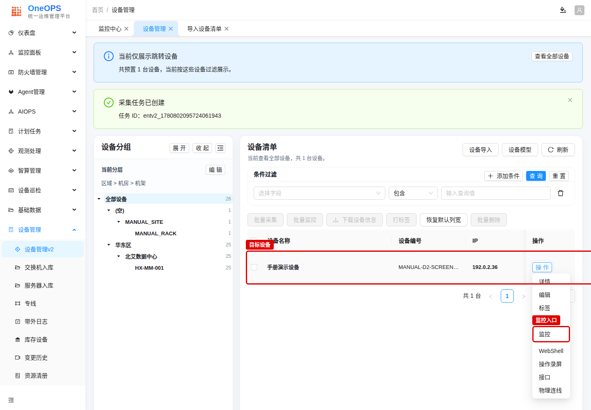

图中红框标出目标设备和“监控”菜单项。

怎么看是否成功：
- 监控结果显示已下发或没有新增任务需要下发。
- 设备的监控下发状态变为已下发。

如果失败：
- 查看监控结果中的“需补齐字段”。
- 如果缺少的是平台或设备类别，并且前一步采集也提示探测未通过，通常说明平台没能通过 SNMP/SSH 自动识别设备。先检查连通性和凭据；如果确认设备信息无误，也可以手动补齐平台和设备类别后再重新监控。
- 按页面提示补充资料后再重新监控。

## 8. 查看监控下发结果

你会完成什么：
判断本次监控动作是否真的完成，以及是否有设备需要补充信息。

开始前确认：
- 已经发起过监控。

操作步骤：
1. 查看监控结果抽屉。
2. 阅读监控任务推送状态。
3. 如果表格中有失败设备，查看“需补齐字段”和说明。
4. 如果页面提供“去编辑”，点击后补齐字段并保存。
5. 只有监控任务推送成功后，才继续到监控任务管理中做对账。如果页面显示“已跳过”“待补资料”或“推送失败”，先处理当前结果，不要直接等待设备进入运行中。
6. 如果是批量设备已经完成监控推送，不要逐台重复对账。统一点击设备清单顶部的“监控任务”，进入监控任务管理页面后按 Agent 完成对账即可。

截图：
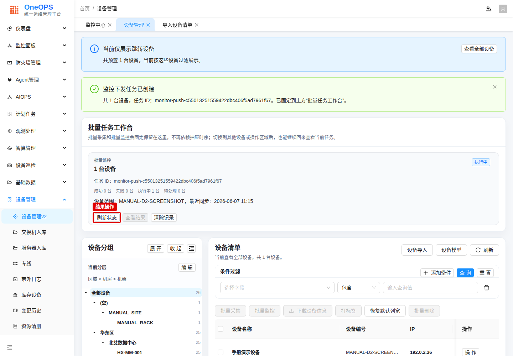

图中红框标出监控任务的结果操作和当前批量任务工作台。

怎么看是否成功：
- 结果中显示监控下发完成。
- 失败列表为空，或失败原因已经处理。

如果失败：
- 提示资料不全时，先按页面提示补充资料。
- 如果提示缺少平台或设备类别，同时采集结果里出现过“采集探测未通过”，先按探测问题处理：检查 SNMP/SSH 连通性、账号密码、Community 和执行目标。探测恢复后再采集，平台和设备类别通常会自动补上；也可以手动补齐后重试监控。
- 提示检测错误时，先检查设备登录方式、账号、密码或 SNMP 信息。
- 找不到可用执行目标或 Agent 时，联系平台管理员确认这台设备所在区域是否有可用 Agent，以及该 Agent 是否支持采集这类设备。

## 9. 对账监控任务并等待运行态

你会完成什么：
从监控任务页面确认任务是否已经下发，并把平台任务和 Agent 上实际运行的任务做一次对账。监控推送成功后必须做这一步；如果没有完成对账，设备监控状态可能会停在“待确认”。

开始前确认：
- 已经执行过监控纳管，并且监控结果显示推送成功。

操作步骤：
1. 打开 `/#/platform/monitoring-tasks`。
2. 在“关键字”中输入设备 IP、任务 ID 片段或设备名称，点击“查询”。
3. 在目标任务行点击“对账”。如果一台设备生成了多条监控任务，可以任选其中一条进入对账。批量设备推送后，也只需要在同一个 Agent 的任务中选择一条作为入口。
4. 在“任务对账”弹窗中确认 Agent。对账是以 Agent 为单位执行的，不是只处理当前这一条任务。同一个采集 Agent 上的其它监控任务也会一起参与本次对账。
5. 点击“刷新对账”，确认平台任务数、Agent 任务数、一致任务和差异数量。
6. 点击“写回同步状态”。页面提示写回完成后，关闭弹窗。
7. 回到设备清单，打开设备详情，等待运行态变化。运行态需要等监控有数据、标签附着成功、状态感知任务执行完成后才会刷新，最长可能需要 30 分钟。等待期间每隔几分钟刷新一次，不要反复推送监控。

截图：
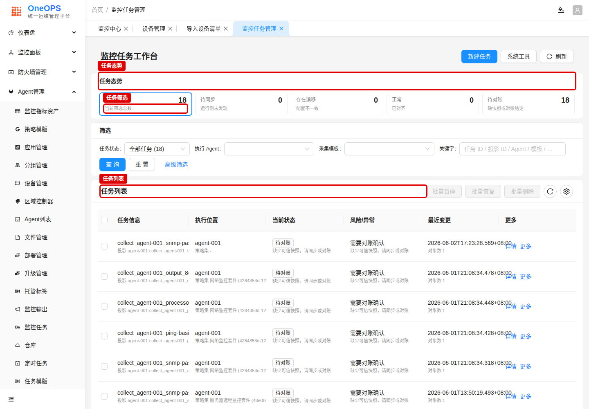

图中红框标出任务态势、筛选区和任务列表。

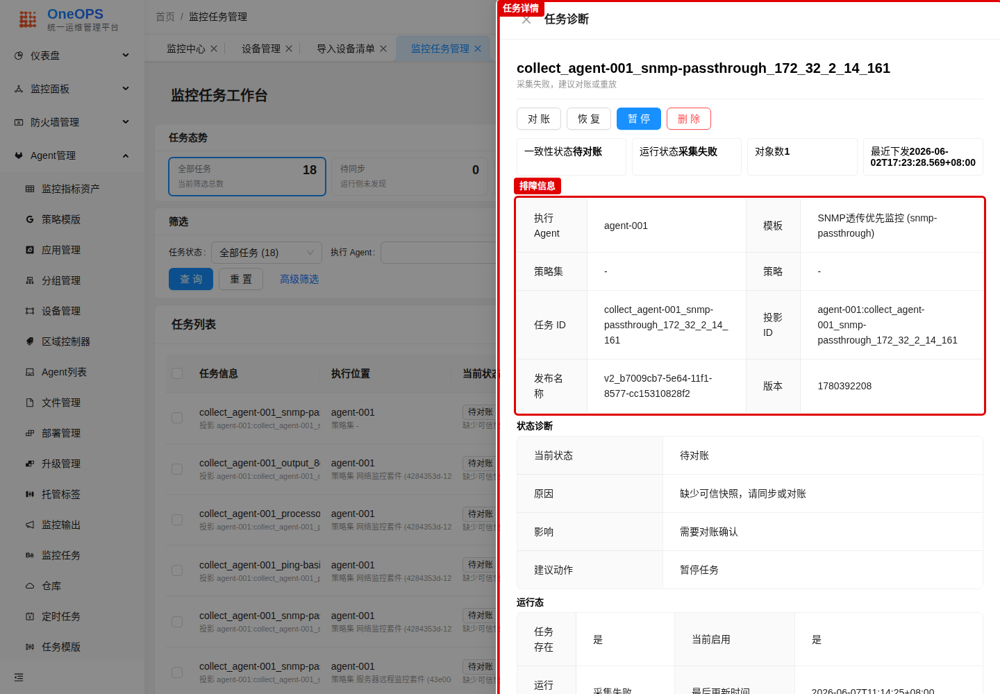

图中红框标出任务诊断抽屉和排障信息区域。

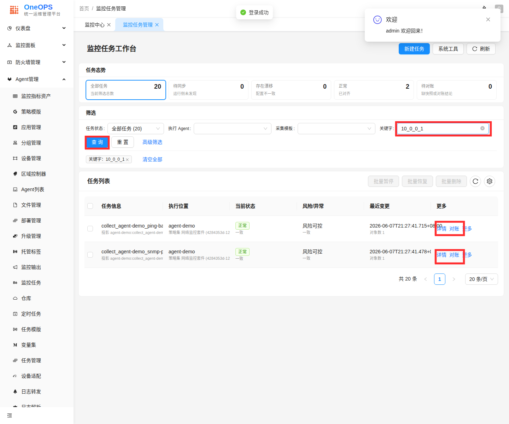

图中红框标出关键字筛选、查询按钮和任务行上的“对账”入口。

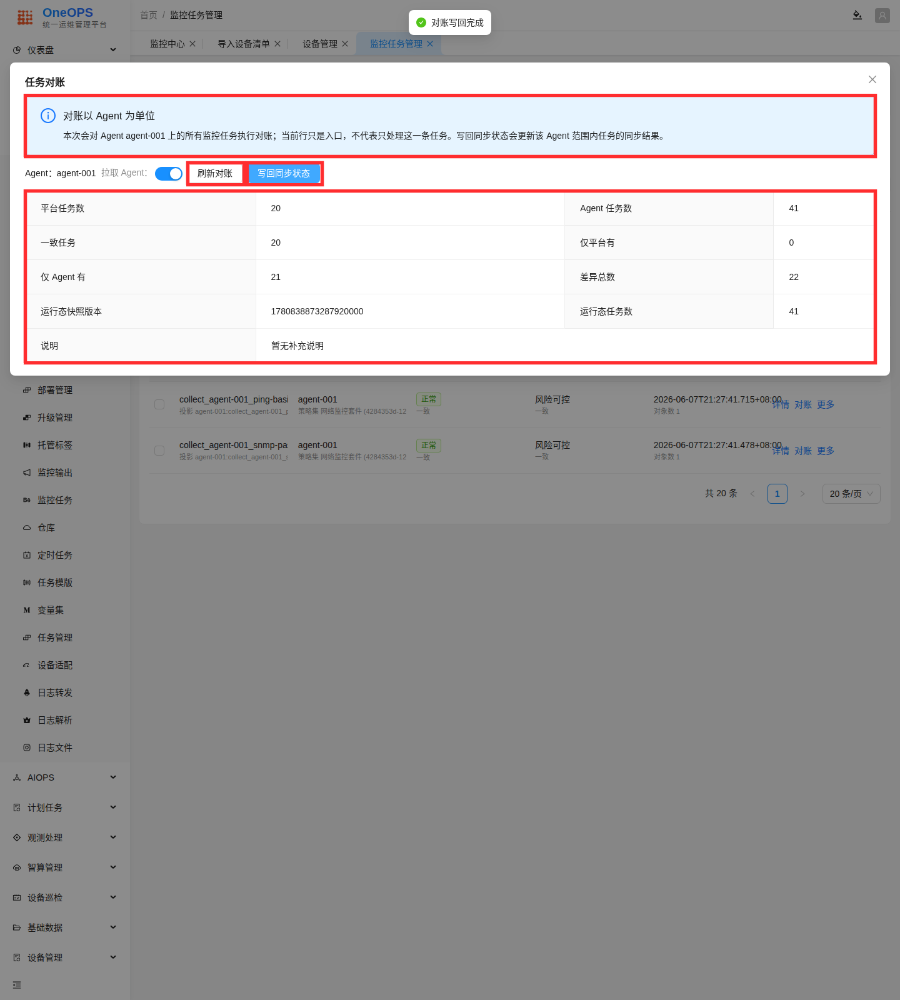

图中红框标出 Agent 级对账说明、“刷新对账”“写回同步状态”和对账结果。写回同步状态后，再回设备详情等待运行态刷新。

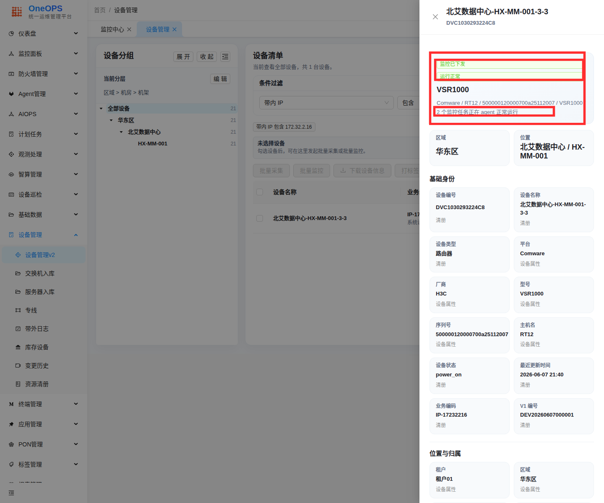

图中红框标出“监控已下发”“运行正常”和监控任务运行说明，说明监控数据、标签附着和状态感知已经完成。

怎么看是否成功：
- 任务列表中能看到相关任务。
- 对账弹窗中可以看到平台任务和 Agent 任务的对账结果。
- 写回同步状态后，任务行显示一致或正常。
- 设备详情从“运行态待确认”变为“运行正常”或“运行中”。

如果失败：
- 如果页面提示任务只在平台记录中存在，优先重新下发，或根据页面提示执行同步检查。
- 如果页面提示任务只在执行端存在，先确认它是不是历史遗留任务，再决定是否删除或修复。
- 如果监控结果还没有推送成功，先回到监控结果处理失败原因，不要在这里等待状态变化。
- 如果对账已经写回，但设备仍然长时间停在“运行态待确认”，联系平台管理员确认状态感知周期任务是否已启用，并检查监控数据和标签是否已经写入。

## 10. 批量操作怎么用

你会完成什么：
知道什么时候使用批量采集或批量监控，以及如何降低误操作风险。

这是可选能力。首次接入时先完成前面的单台流程；只有多台设备条件相近、且单台已经成功时，再使用批量操作。

开始前确认：
- 你已经用单台设备走通过入库、采集和监控。
- 批量设备的访问方式、凭据和网络条件相近。

操作步骤：
1. 在设备清单勾选多台设备。
2. 点击“批量采集”或“批量监控”。
3. 查看确认信息，确认影响范围。
4. 点击确认执行。只有确认执行并创建任务后，批量任务工作台才会保存并固定在页面上；确认前退出页面或重新登录，不会保留未提交的工作台。
5. 执行后回到批量任务工作台查看结果。

怎么看是否成功：
- 批量任务工作台显示当前批量任务状态。
- 每台设备有自己的结果，不需要猜是哪一台失败。

如果失败：
- 先处理失败设备，不要重复执行全部设备。
- 批量失败数量较多时，先选一台失败设备按单台流程排查。

## 11. 常见问题

### 设备已经入库，为什么还不能监控？

入库只表示平台有了设备资产记录。监控还需要可用的访问方式和执行目标。网络设备通常先确认 SNMP，服务器先确认 SSH；如果页面提示资料不全，再按提示补齐。

### 网络设备可以不采集，直接推送监控吗？

可以，但前提是导入时已经提供平台、设备类别和可用 SNMP 凭据。这样平台不需要先通过采集探测来识别设备，也能直接尝试监控纳管。默认 SNMP 凭据只有在它确实适用于目标设备时才建议选择。采集可以稍后再做，用于补充接口、配置或更多设备详情。

### 采集失败先查什么？

先看失败说明。资料不全时补资料；检测错误时检查登录方式、账号、密码或 SNMP 信息；其它原因可以下载诊断日志，交给平台管理员或支持人员分析。

### 监控结果提示缺少字段怎么办？

点击设备编辑，按提示补齐资料，保存后重新执行监控。如果缺少的是平台或设备类别，同时采集结果提示过探测未通过，先检查 SNMP/SSH 连通性和凭据。探测失败会导致平台、设备类别无法自动识别，监控推送时就会表现为缺资料。

### 为什么监控推送后还要去监控任务管理对账？

监控推送只表示平台已经发起下发动作。还需要到监控任务管理里执行对账，把平台记录和 Agent 上实际运行的任务同步起来。没有完成对账时，设备监控状态可能会停在“待确认”，不会进入“运行中”。

### 为什么对账后还没有立刻显示运行正常？

运行态不会在点击“写回同步状态”后立刻变化。系统需要先拿到监控数据，再完成标签附着，最后由状态感知任务刷新设备状态。这个过程通常会自动完成，最长可能需要 30 分钟。等待期间可以刷新设备详情查看状态，不建议频繁重复推送监控。

### 批量设备都推送了监控，需要逐台对账吗？

不需要。对账是以 Agent 为单位执行的。批量设备完成监控推送后，统一进入“监控任务”页面，按执行 Agent 选择一条相关任务发起对账即可。不要每台设备都重复对账，频繁拉取 Agent 运行态和写回同步状态会增加系统开销。

### 已经采集或监控过，还能再执行一次吗？

可以。再次采集会重新读取设备信息并更新采集结果；再次监控会重新触发监控下发。不要短时间内频繁重复点击，按需要重试或确认最新状态即可。

### 为什么建议先单台走通，再做批量？

单台流程更容易定位问题。单台成功后，再批量操作可以减少大面积失败。

## 12. 完成检查清单

- [ ] 设备已完成入库，并且已经出现在设备清单中。
- [ ] 可以通过设备编码、名称或 IP 找到设备。
- [ ] 已经执行过一次采集，并能看到采集结果或失败原因；如果网络设备按“平台、设备类别、SNMP 凭据齐全后直接监控”的方式接入，可以跳过这项。
- [ ] 已经执行过监控，并能看到监控下发结果。
- [ ] 已经在监控任务管理中完成对账，并写回同步状态。
- [ ] 设备详情中已经显示“监控已下发”，并最终变为“运行正常”或“运行中”。
- [ ] 失败设备有明确下一步处理动作。
