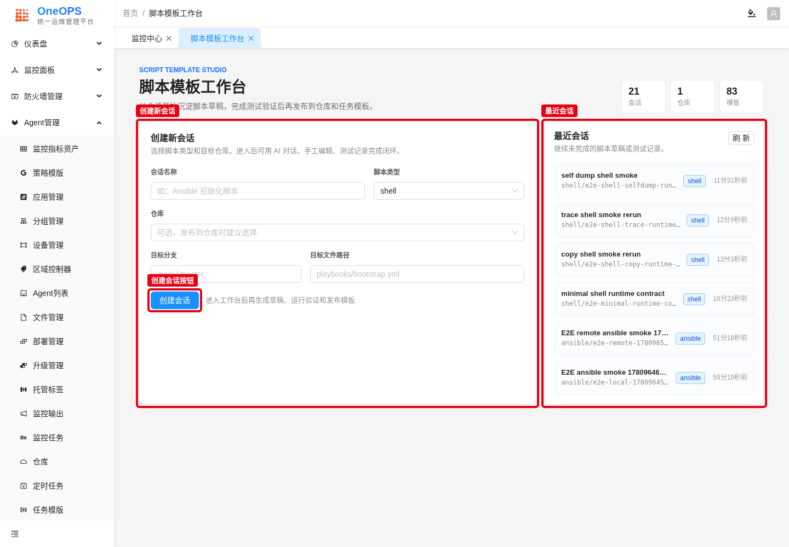
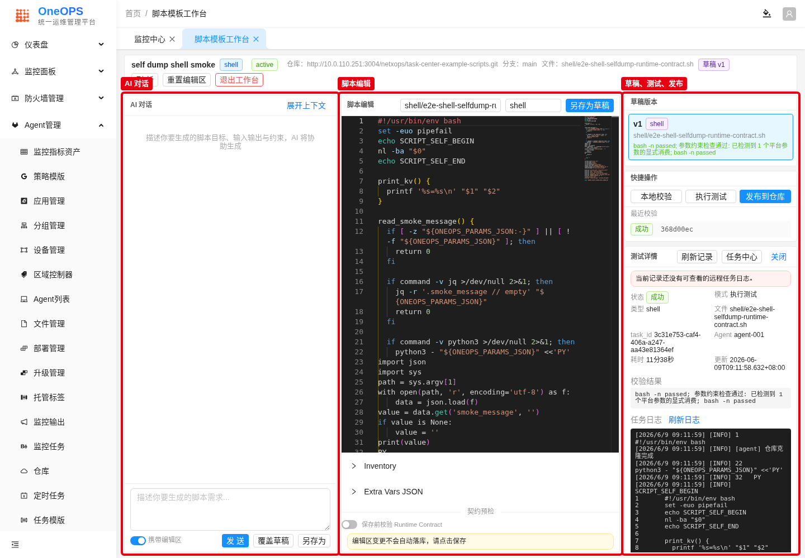
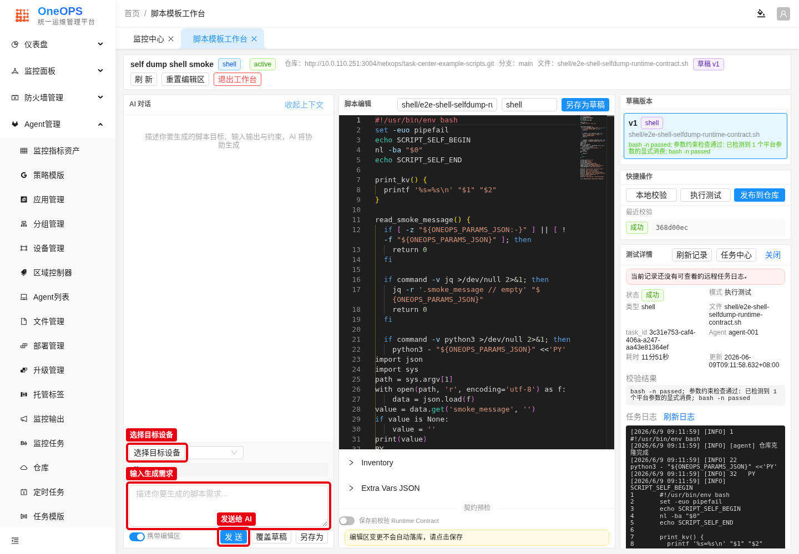
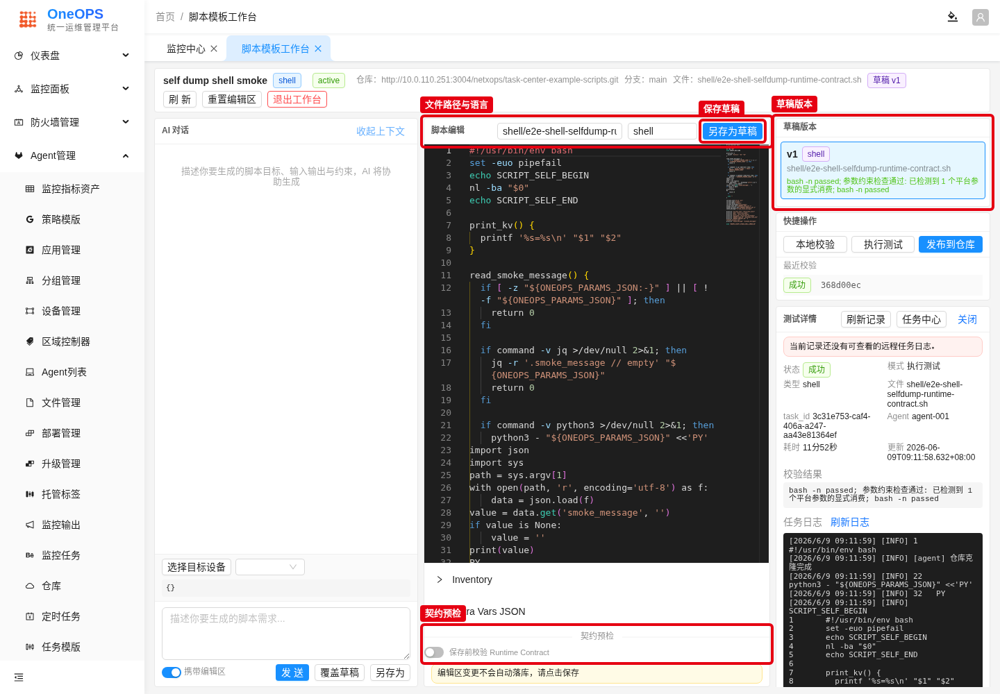
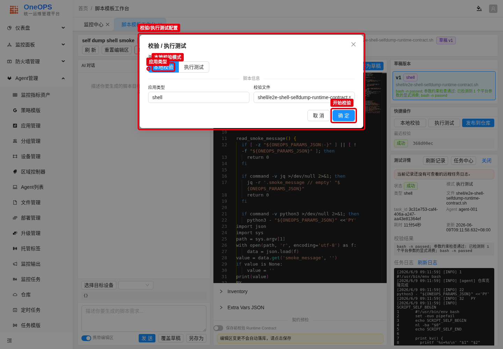
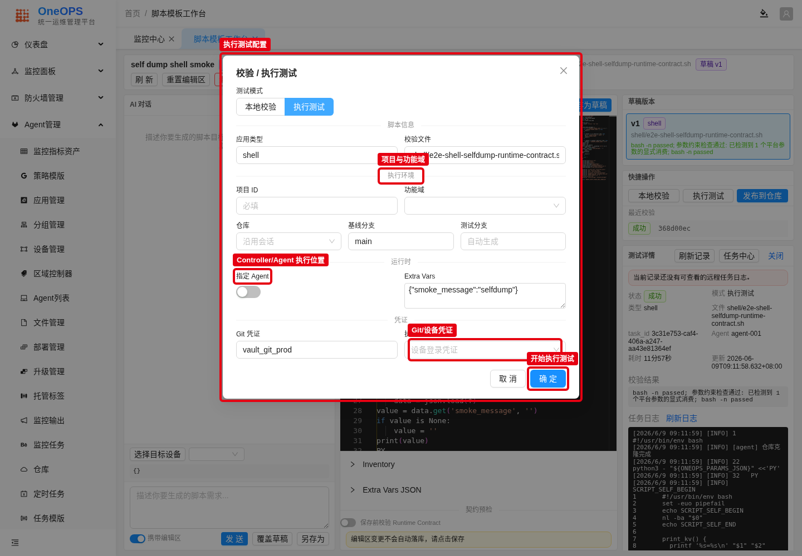
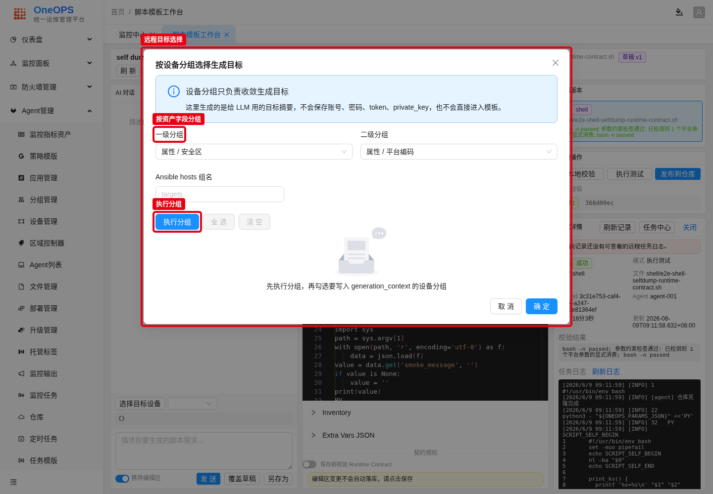
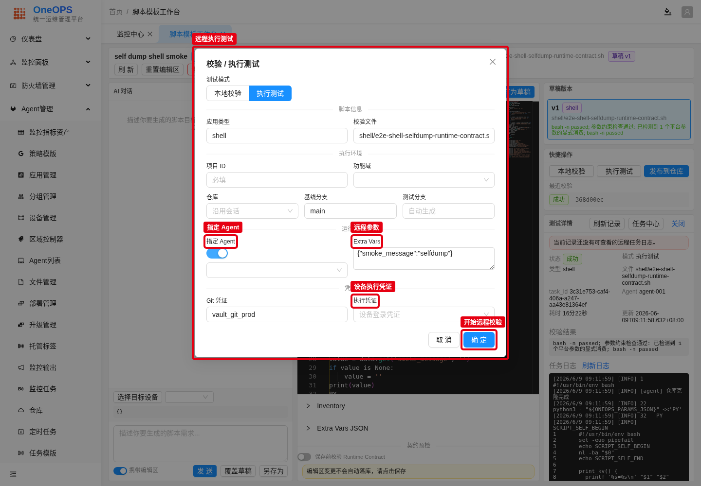
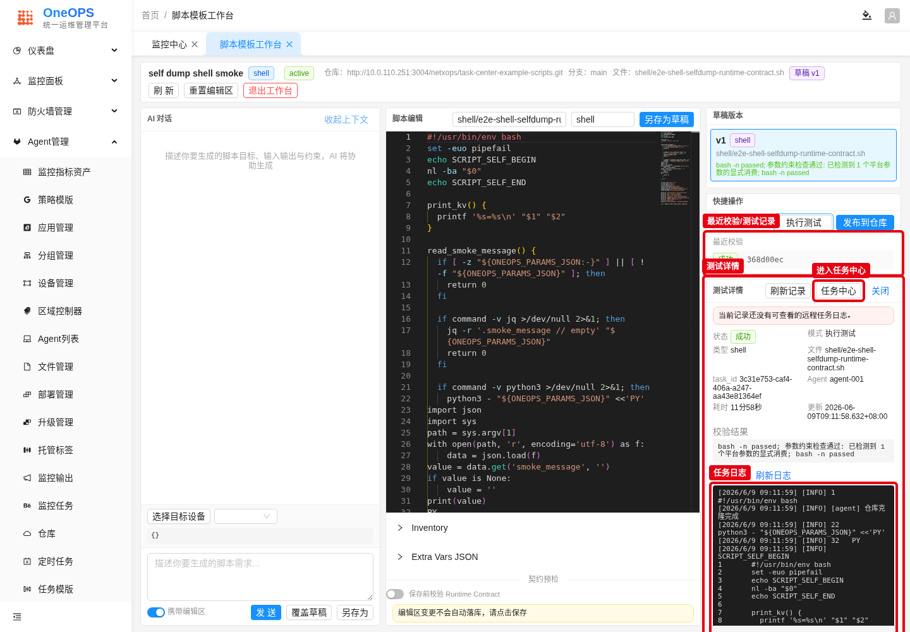
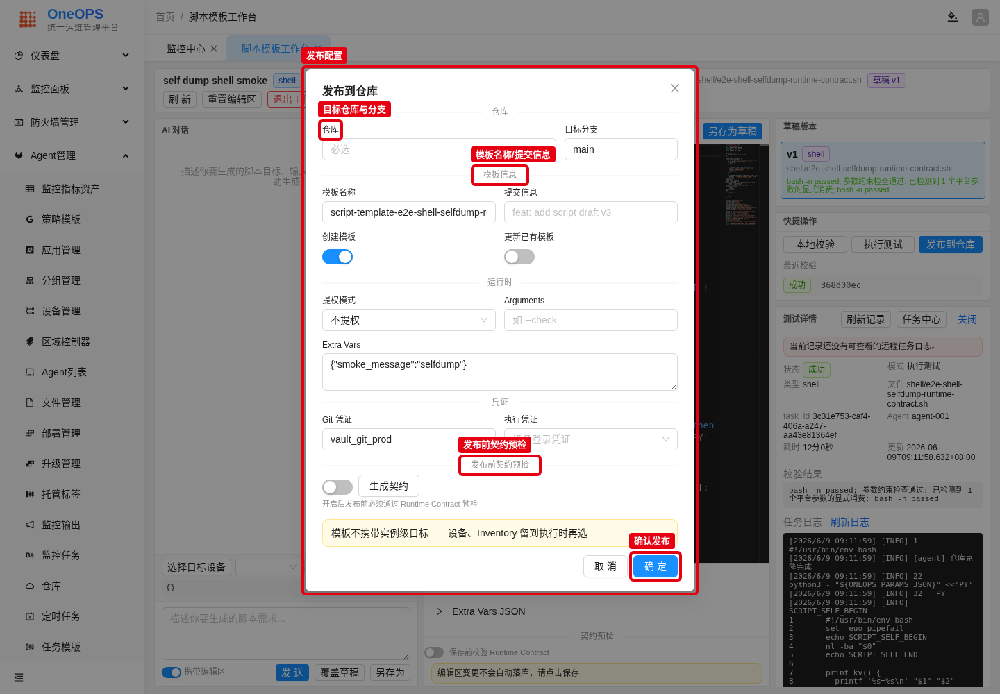

# 脚本模板工作台使用手册

这份手册用于指导你在 OneOPS 中创建、生成、验证并发布脚本模板。建议先用测试脚本完成一次完整闭环，确认本地校验和执行测试通过后，再发布到仓库和任务模板。

适用入口：
- 页面地址：`/#/platform/script-template-studio`
- 菜单位置：平台能力中的“脚本模板工作台”

使用前确认：
- 你已经登录 OneOPS，并具备脚本模板、仓库、任务执行相关权限。
- 如果需要发布到 Git 仓库，系统中已经配置可用仓库和 Git 凭证。
- 如果需要在 Agent 或设备侧执行测试，系统中已经注册可用 Agent，并且设备凭证已经入库。
- 模板上线前必须完成测试验证；未验证或验证失败的草稿不要发布。

## 1. 进入工作台并创建会话

你会完成什么：
创建一个脚本会话，确定脚本类型、目标仓库、目标分支和文件路径。会话是后续 AI 生成、草稿保存、测试记录和发布记录的容器。

操作步骤：
1. 打开 `/#/platform/script-template-studio`。
2. 在“创建新会话”区域填写会话名称。
3. 选择脚本类型，例如 `shell`、`python` 或 `ansible`。
4. 选择目标仓库，填写目标分支和目标文件路径。
5. 点击“创建会话”进入工作台。
6. 如果已经有会话，可以在“最近会话”中直接点击继续。

截图：


图中红框标出创建会话区域、创建按钮和最近会话入口。

怎么看是否成功：
- 页面进入三栏工作区。
- 顶部显示当前会话名称、脚本类型、仓库、分支和目标文件。

## 2. 熟悉工作台布局

工作台分为三部分：
- 左侧是 AI 对话，用来描述需求、携带上下文并生成脚本草稿。
- 中间是脚本编辑区，用来查看、修改、保存草稿，并做 Runtime Contract 预检。
- 右侧是治理动作区，用来选择草稿版本、发起本地校验、执行测试、发布到仓库，并查看测试详情和日志。

截图：


图中红框标出 AI 对话、脚本编辑、草稿测试发布三个核心区域。

## 3. 使用 AI 生成脚本

你会完成什么：
把任务目标、执行对象、输入输出约束告诉 AI，让 AI 生成更符合平台运行契约的脚本。

操作步骤：
1. 点击“展开上下文”。
2. 如需针对设备生成脚本，点击“选择目标设备”，选择设备分组或目标设备。这里生成的是给 AI 使用的目标摘要，不会把密码、token 或 private key 写入模板。
3. 根据需要选择提权模式。
4. 在输入框描述脚本目标。建议说明脚本类型、运行位置、参数、输出文件、成功条件和失败处理。
5. 如果希望 AI 参考当前编辑区内容，保持“携带编辑区”开启。
6. 点击“发送”。

推荐提示词示例：

```text
请生成一个 shell 脚本，用于在 OneOPS 任务运行时读取 ONEOPS_PARAMS_JSON 中的 smoke_message，
输出当前执行用户、工作目录和 smoke_message。脚本需要遵守平台 Runtime Contract，
失败时返回非 0，并避免输出任何凭证内容。
```

截图：


图中红框标出目标设备选择、需求输入框和发送按钮。

怎么看是否成功：
- AI 对话区出现生成结果。
- 你可以把生成内容保存为草稿，或复制到脚本编辑区继续修改。

## 4. 编辑脚本并保存草稿

你会完成什么：
把脚本内容保存为草稿版本，形成后续校验、执行测试和发布的对象。

操作步骤：
1. 在中间编辑器检查脚本内容。
2. 确认文件路径和语言设置正确。
3. 如果模板需要明确运行契约，开启“保存前校验 Runtime Contract”，并填写契约 JSON 和入口文件。
4. 点击“另存为草稿”保存新版本。
5. 在右侧“草稿版本”中确认新草稿出现。

截图：


图中红框标出文件路径、保存草稿、契约预检和草稿版本区域。

怎么看是否成功：
- 右侧出现新的 `vN` 草稿版本。
- 草稿卡片中显示语言、文件路径和校验摘要。

注意：
- 编辑区变更不会自动保存，修改后必须点击保存。
- 模板不应固化实例级设备、账号、密码或 token；这些信息应在执行时由平台注入。

## 5. 执行本地校验

你会完成什么：
在发布或真实执行前，先检查脚本语法和平台参数消费情况。

操作步骤：
1. 在右侧“快捷操作”中点击“本地校验”。
2. 确认测试模式为“本地校验”。
3. 检查应用类型和校验文件。
4. 点击“确定”开始校验。
5. 校验完成后，在“最近校验”和“测试详情”中查看结果。

截图：


图中红框标出校验模式、脚本信息和开始校验按钮。

怎么看是否成功：
- 状态显示“成功”。
- 校验结果中出现语法检查通过、参数约束检查通过等摘要。

如果失败：
- 先修复语法错误。
- 再检查脚本是否按平台约定读取参数，例如 `ONEOPS_PARAMS_JSON`。
- 修复后重新保存草稿并再次校验。

## 6. 执行测试

你会完成什么：
通过真实任务执行验证脚本。执行测试可以覆盖 Controller 本地执行和 Agent 本地执行；如果要校验设备侧链路，请继续看下一节“远程校验”。

操作步骤：
1. 点击“执行测试”。
2. 将测试模式切换为“执行测试”。
3. 填写项目 ID 和功能域。
4. 确认仓库、基线分支和测试分支。
5. 如果要在 Controller 上执行，保持“指定 Agent”关闭。
6. 如果要在 Agent 上执行，打开“指定 Agent”，选择目标 Agent。
7. 填写 Extra Vars，例如 `{"smoke_message":"hello"}`。
8. 点击“确定”开始执行测试。

截图：


图中红框标出项目与功能域、Controller/Agent 执行位置、凭证和开始执行测试按钮。

怎么看是否成功：
- 测试记录状态显示“成功”。
- 任务详情中能看到 `task_id`、执行模式、Agent 信息和任务日志。

注意：
- Controller 执行适合验证平台侧脚本能力。
- Agent 执行适合验证现场执行环境、Agent 工作目录、仓库拉取和脚本运行。
- 如果脚本需要访问设备，不要只做本地校验，必须补做远程校验。

## 7. 远程校验

你会完成什么：
用当前入库设备、Agent 和设备凭证完成真实远程链路验证。远程校验不是一个单独按钮，而是在“执行测试”模式下同时指定目标设备、执行 Agent、运行参数和凭证。

远程校验适用于：
- 脚本需要 SSH、SNMP、WinRM、HTTP API 等方式访问设备。
- 脚本依赖 Agent 所在网络环境访问目标设备。
- 模板准备上线给现场任务使用，需要确认设备、凭证、Agent、Controller 的完整链路。

操作步骤：
1. 在 AI 上下文或 Inventory 区域点击“选择目标设备”或“按设备分组生成”。
2. 选择一级分组、二级分组，点击“执行分组”。
3. 勾选要参与远程校验的设备分组，确认后生成目标摘要或 Inventory。这里不会保存账号、密码、token 或 private key。
4. 回到工作台，点击“执行测试”。
5. 将测试模式切换为“执行测试”。
6. 打开“指定 Agent”，选择能够访问目标设备的 Agent。
7. 选择执行凭证。设备凭证应来自平台凭证管理或设备绑定，不要写入脚本。
8. 填写 Extra Vars。只填写业务参数，不填写明文密码。
9. 点击“确定”发起远程校验。
10. 在测试详情中查看 `task_id`、Agent、校验结果和任务日志。

截图：


图中红框标出设备分组、执行分组和目标摘要入口。

截图：


图中红框标出指定 Agent、远程参数、设备执行凭证和开始远程校验按钮。

怎么看是否成功：
- 测试记录状态显示“成功”。
- 测试详情中显示 `task_id` 和 Agent。
- 任务日志中能看到 Controller 创建任务、Agent 收到任务、脚本执行完成。
- 如果脚本访问设备，日志或结果中应能看到设备侧检查结果，而不只是脚本本地输出。

如果失败：
- Agent 不可用时，先检查 Agent 状态、功能域和网络连通性。
- 设备连接失败时，检查设备 IP、访问协议、端口和执行凭证。
- Git 拉取失败时，检查仓库、分支和 Git 凭证。
- 参数缺失时，检查 Extra Vars、Runtime Contract 和脚本读取参数的方式。

## 8. 查看测试结果和任务日志

你会完成什么：
确认脚本在真实执行链路中完成，并能定位失败原因。

操作步骤：
1. 在右侧“最近校验”中点击一条记录。
2. 查看“测试详情”中的状态、模式、类型、文件、`task_id` 和 Agent。
3. 点击“刷新记录”获取最新状态。
4. 如果需要进入任务中心排查，点击“任务中心”。
5. 查看“任务日志”，确认 Controller、Agent、脚本输出和错误信息。

截图：


图中红框标出测试记录、测试详情、任务中心入口和任务日志。

怎么看是否成功：
- 状态为“成功”。
- 日志中能看到脚本输出和平台执行摘要。
- 如果是 Agent 执行，日志中能看到 Agent 收到任务、准备仓库和进程执行完成。

如果失败：
- 先看校验结果，再看任务日志。
- Git 拉取失败时检查仓库、分支和 Git 凭证。
- Agent 不可用时检查 Agent 注册状态和功能域。
- 设备连接失败时检查设备 IP、访问协议、端口和执行凭证。

## 9. 发布到仓库和任务模板

你会完成什么：
把已验证的草稿发布到 Git 仓库，并按需创建或更新任务模板。

操作步骤：
1. 确认草稿已经通过本地校验和执行测试。
2. 点击“发布到仓库”。
3. 选择仓库和目标分支。
4. 填写模板名称和提交信息。
5. 根据需要开启“创建模板”或“更新已有模板”。
6. 填写运行时参数、Git 凭证和执行凭证。
7. 如需强制契约治理，开启“发布前契约预检”，点击“生成契约”或填写契约内容。
8. 确认模板不携带实例级目标信息后，点击“确定”发布。

截图：


图中红框标出目标仓库与分支、模板信息、发布前契约预检和确认发布按钮。

上线标准：
- 至少有一次本地校验成功。
- 至少有一次执行测试成功。
- 需要 Agent 或设备执行的模板，必须完成远程校验，并在对应执行路径上验证成功。
- 模板不包含明文密码、token、private key 或实例级设备绑定。
- 发布前契约预检通过。

## 10. 常见问题

看不到仓库：
先确认仓库配置已经入库，并且当前账号有仓库访问权限。

发送给 AI 后结果不符合预期：
补充脚本运行契约、目标设备背景、输入参数、输出要求和失败处理方式后重新发送。

本地校验成功但执行测试失败：
通常是仓库、分支、Agent、凭证或运行环境问题。优先查看任务日志。

执行测试没有日志：
点击“刷新记录”和“刷新日志”。如果仍没有日志，到任务中心按 `task_id` 查询。

发布按钮可点但不建议发布：
只有测试验证成功、契约预检通过、且不携带实例级敏感信息的草稿才应发布。
